# 虚拟机下的OpenWrt指南

## 0 简介

OpenWrt是一个基于Linux的开源路由系统，选择OpenWrt的理由主要有两点：

1. 需要一个能接管所有本地流量的**透明代理**。

   Windows客户端常用的代理软件如CFW(*Clash for Windows*)等，其在未开启`TUN`模式下通常只能代理网页流量和部分IM软件流量，而不能其他软件的流量（即绝大部分软件都不遵循系统代理）。最常见的情况就是使用CMD控制台执行`pip install`指令安装Python包时下载速度很慢，使用`git push`指令时经常上传失败，因无法代理UDP流量导致WebRTC泄露等等，这些都是流量没有被接管的体现。如果有一个能够接管全部本地流量的透明代理将不会出现上述问题。

2. 需要一个能**高度客制化**网络管理的系统。

   OpenWrt的自由度极高，能从各个细节客制化网络管理，比如DNS转发、负载均衡、流量分流等，也有各类丰富的插件可以即拿即用，比如屏蔽网页端广告、解锁音乐播放软件灰色曲目等。

使用OpenWrt系统最好是购买Cpu和网卡都达标的路由硬件，但是这类路由器价格普遍较高，如果选可扩展性强的x86架构路由器，还需要再单独加装硬盘、内存，这也带来了额外的成本。

如果想零成本体验之后再购买硬件，那么最好的选择就是将OpenWrt安装在虚拟机里模拟操作一遍。其实如果不介意长时间开启电脑主机的话，也完全可以把虚拟机OpenWrt当作主力路由来使用。

本文所用的虚拟机平台是VMware Workstation，所有软件及固件都采用当前最新版本。

虚拟机安装OpenWrt可以有三种网络结构：

1. 仅使用lan的旁路网关
2. lan-wan结构的路由
3. lan-wan结构的路由级联

以上三种网络结构安装难度逐渐递增，且都存在非常多的暗坑。下面将具体讲解安装步骤。~~（不需要深入了解具体原理，照着操作就不会出问题，大概）~~

## 1 共通准备

前述三种网络结构都有共通的需要准备的部分：

+ 下载OpenWrt固件
+ 转换OpenWrt固件格式
+ 下载VMware虚拟机

### 1.1 下载OpenWrt固件

[固件地址](https://downloads.openwrt.org/releases/ "https://downloads.openwrt.org/releases/")

下拉下载页面到最底端，找到如图所示的最新发行版。

进入`/targets/x86/64/`，选择第一项下载。

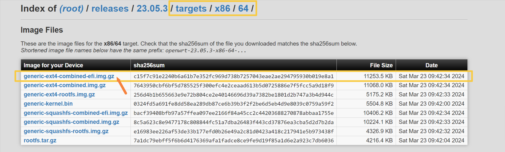

用7z解压得到一个`.img`格式的映像文件。

> 注意：使用7z解压时可能会报错: *有效数据外包含额外数据 : openwrt-23.05.3-x86-64-generic-ext4-combined-efi.img*。无视该报错。

### 1.2 转换OpenWrt固件格式

下载StarWind V2V Converter转换器，该转换器可以将`.img`格式的映像文件转化为`.vmdk`格式的磁盘文件。

[转换器地址](https://www.starwindsoftware.com/tmplink/starwindconverter.exe "https://www.starwindsoftware.com/tmplink/starwindconverter.exe")

运行StarWind V2V Converter转换器：

+ Select the location of the image to convert: 选择第二项 Local file(File on the local machine)。
+ Source image: 选择之前下载的`.img`映像文件路径。
+ Select the location of the destination image: 选择第一项 Local file(File on the local machine)。
+ Select destination image format: 选择第一项 VMDK(VMware Virtual Machine Disk)。
+ Select option for VMDK image format: 选择第一项 VMware Workstation growable image。使用该选项创建出的磁盘文件是可扩容的。
+ 选择好目的路径之后直接 convert 就可以得到一个`.vmdk`后缀的磁盘文件。

### 1.3 下载VMware虚拟机

下载VMware Workstation Pro。当前最新版本为17。

[VMware下载地址](https://www.vmware.com/go/getworkstation-win "https://www.vmware.com/go/getworkstation-win")

在安装时使用key激活。~~（一个可用key: MC60H-DWHD5-H80U9-6V85M-8280D）~~

## 2 搭建仅使用lan的旁路网关

该网络结构的**唯一优点**是搭建方便，网络拓扑结构简单。缺点很多，因为这是一个不符合规范的非对称网络结构。当宿主机只能连接WiFi时，宿主机通信将和虚拟机内的OpenWrt通信冲突，导致宿主机无法正常上网，在同一个VMnet下的其他虚拟机可以正常上网。因此只推荐在**能够连接有线网线**的情况下使用这个网络结构。此外，该网络结构相比于后两章介绍的lan-wan路由结构来说，会带来非常大的网速性能损失。如果只能连接无线网络，或对网速有一定要求，则推荐直接跳转阅读[下一个](#3-搭建lan-wan结构的路由)网络结构。

### 2.1 设置VMware的VMnet

进入VMware后选择 编辑->虚拟网络编辑器->更改设置（需要管理员权限），进入如下图所示的VMnet设置界面。

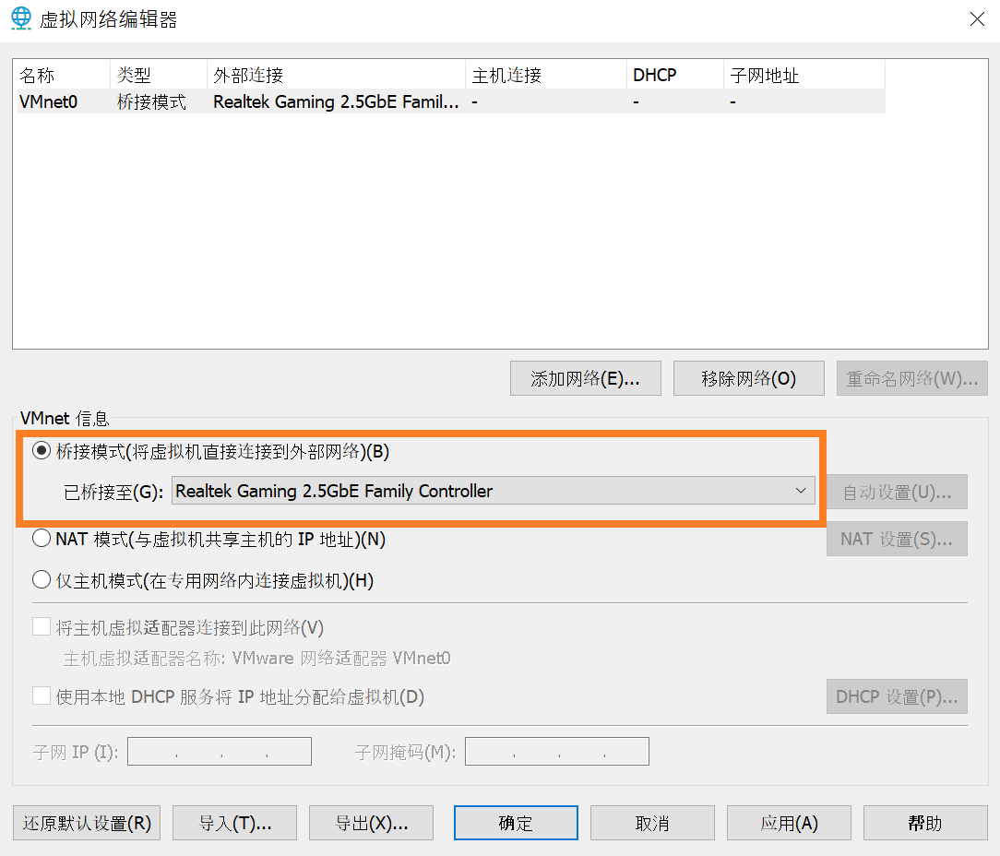

该网络结构只需要一个VMnet子网，将VMnet 0设置为桥接模式，桥接网卡选项由默认的自动改为物理有线网卡。

### 2.2 安装虚拟机

将之前转换得到的vmdk文件放入一个新建文件夹中，该文件夹将用作虚拟机文件夹。

+ 选择 文件->新建虚拟机->自定义(高级)，下一步
+ 硬件兼容性选择最上面的一项（当前是Workstation 17.x），下一步
+ 安装来源选择稍后安装操作系统，下一步
+ 客户机操作系统选择Linux，版本选择其他Linux 5.x内核64位，下一步
+ 虚拟机名称自定，位置选择前述的新建文件夹，下一步

  > 注意：此时会给出警告（"指定位置似乎已包含现有虚拟机"），直接选择继续即可。

+ 处理器数量1，内核数量4即可，下一步

  > 只要满足处理器数量乘以内核数量小于宿主机处理器内核总数都可以。

+ 虚拟机内存1024MB即可，下一步
+ 选择不使用网络连接，下一步
+ SCSI控制器类型保持默认，即LSI Logic，下一步
+ 虚拟磁盘类型保持默认，即SCSI，下一步
+ 选择使用现有虚拟磁盘，下一步
+ 磁盘位置选择为前述的新建文件夹中的vmdk文件，下一步
+ 弹窗提示是否将现有虚拟磁盘转换为更新的格式，选择保持现有格式即可
+ 选择自定义硬件
  + 移除以下几个硬件：新CD/DVD，USB控制器，声卡，打印机
  + 选择 添加->网络适配器
  + 网络连接部分选择 自定义->VMnet0

硬件部分最终设置结果如下图。

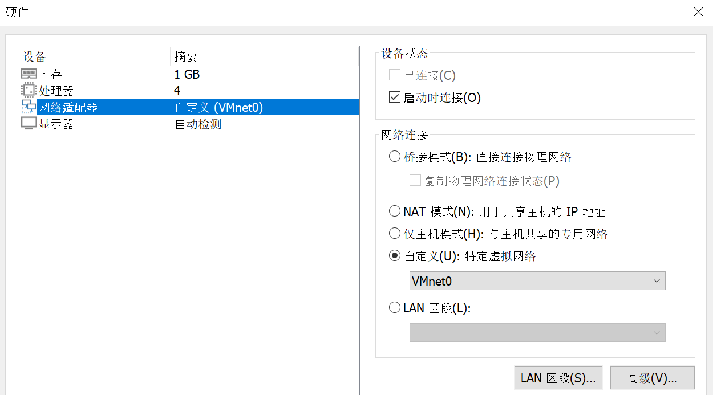

*可选操作*：选择 编辑虚拟机设置->选项->高级->不为启用了 Hyper-V 的主机启用侧通道缓解。禁用测通道缓解后可以提高虚拟机性能。

### 2.3 设置OpenWrt

开启虚拟机，待其加载一段时间后按回车就进入虚拟机的主界面了。

> 注意：如果虚拟机界面在VMware中显示得特别小，就选择 查看->拉伸客户机->保持纵横比拉伸。

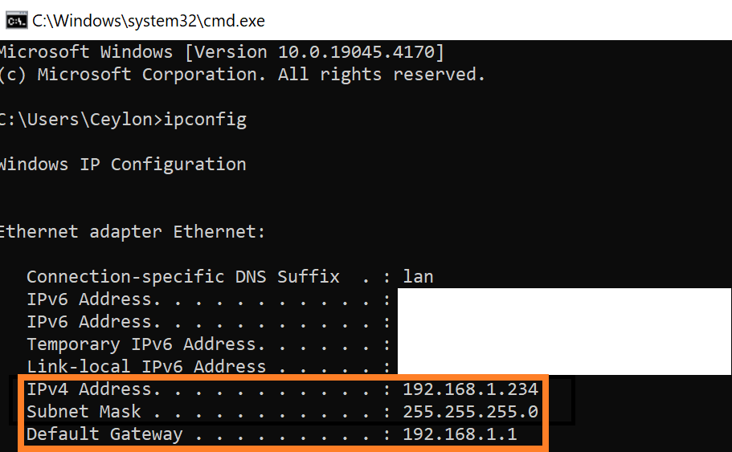

第一次进入时需要设置密码。输入`passwd`指令按照提示设置密码。

> 注意：OpenWrt虚拟机内如果要使用小键盘需要先用Numlock键解锁。

在进行下一步的操作之前需要先确定宿主机的ip地址。打开CMD命令提示行，输入`ipconfig`指令，找到之前设置桥接的物理有线网卡，确认其ip。如下图，我的宿主机ip地址是`192.168.1.234/24`，网关ip地址是`192.168.1.1`。

下面需要更改OpenWrt的lan口ip地址。输入`vim /etc/config/network`指令进入vim编辑界面。

使用方向键（或`h` `j` `k` `l`键）将光标移动至下图所示处。

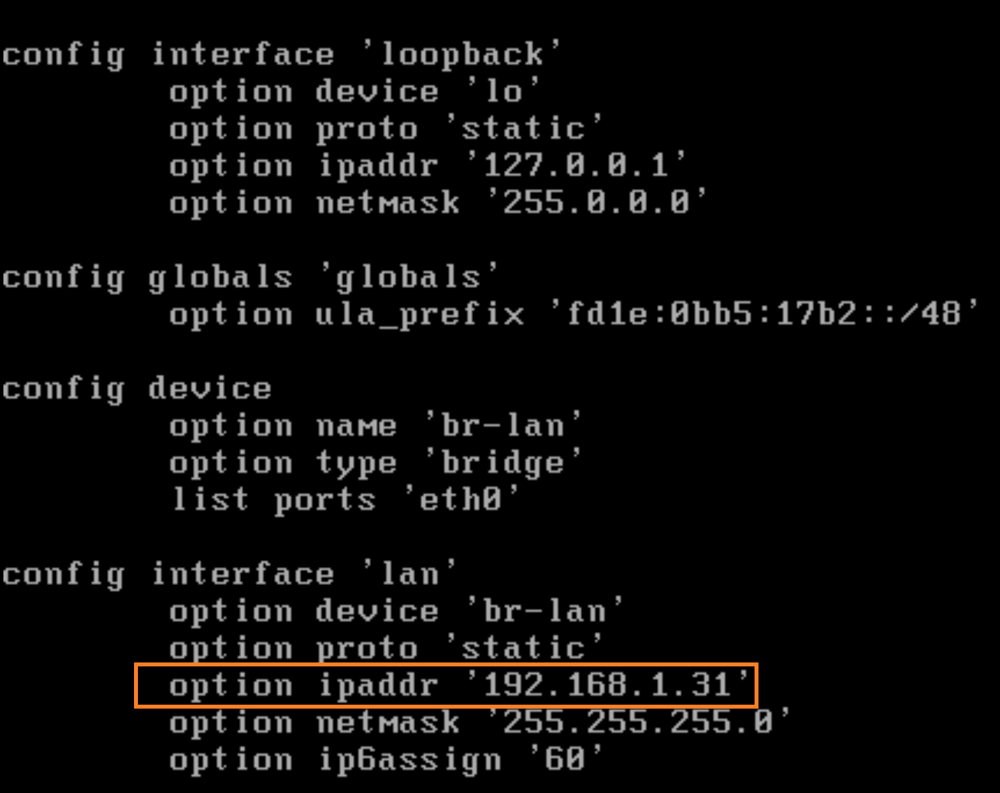

按`i`键即可开始输入内容，修改ip地址。lan口ip地址的前三段与宿主机ip地址前三段保持一致，最后一段从1至254之间选择一个与宿主机网关所在局域网内所有设备ip地址最后一段都不同的数字，本文选择的是31。

修改完成之后按`Esc`，再输入`:wq`后按回车键，这样就保存并退出了。

输入`reboot`指令重启OpenWrt操作系统（或输入`service network restart`指令重启网络服务即可）。

### 2.4 进入LuCI主界面

打开宿主机浏览器，输入之前设置的OpenWrt lan口ip地址。

如果看到以下界面就说明第一步成功了🎉

输入密码登录以后，选择 Network->Interface->Edit。

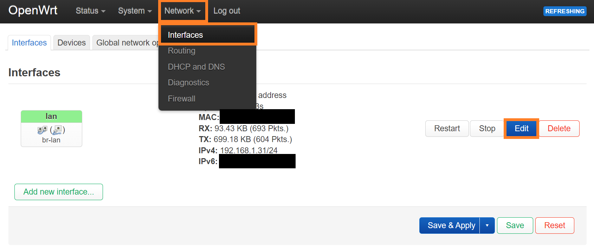

下面是lan口的配置修改内容：

+ General Settings -> IPv4 gateway 修改为之前查看到的宿主机网关ip地址（即主路由lan口的ip地址）
+ Advanced Settings -> Use custom DNS servers 推荐添加两个谷歌DNS，地址为`8.8.8.8`，`8.8.4.4`。

  > 这里设置的DNS地址负责所有进出OpenWrt lan口的域名解析工作。包括解析OpenWrt自身需要访问的域名（比如执行`opkg`指令安装各种包时需要用到），也包括处理宿主机向OpenWrt发送的域名解析请求。

+ DHCP Server -> General Setup -> Ignore interface 勾选该项。

  > 所有DHCP服务交给主路由来完成。如果关闭了主路由的DHCP服务，则可以开启OpenWrt的DHCP服务，即两者只能开启其中一个。

## 3 搭建lan-wan结构的路由

## 4 搭建lan-wan结构的路由级联

## 5 附录

### 5.1 直接使用.img文件安装系统的方法

直接使用`.img`格式的映像文件来安装系统，相较于前述使用转换软件将其转换成虚拟机磁盘格式`.vmdk`文件之后再使用的方法来说比较繁琐，但是如果想要将OpenWrt安装到实际的硬件环境上只能使用`.img`格式的映像文件，用虚拟机模拟一遍有助于增强理解。

#### 5.1.1 将.img文件烧录入U盘

首先需要将`.img`映像文件烧录入U盘中，用到软件balenaEtcher。（烧录时会格式化U盘，原来的所有储存信息都会丢失）

[Etcher下载地址](https://etcher.balena.io/#download-etcher "https://etcher.balena.io/#download-etcher")

选择 Flash from file 选项开始烧录。

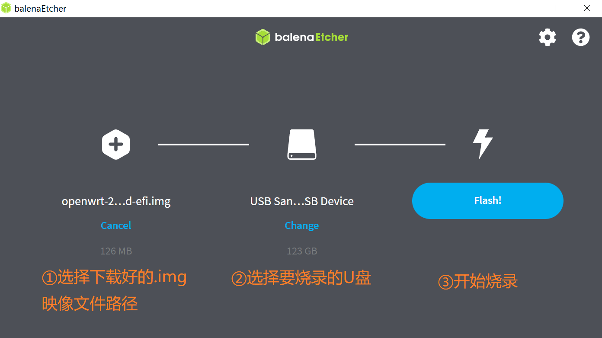

完成烧录后会出现很多弹窗，提示需要格式化U盘，直接关闭这些弹窗，可以发现原来的U盘图标变成了一个名叫 Removeable Disk 的盘符。现在将U盘拔下并重新连接至电脑，此时可以看见多了三个盘符，其中两个盘符双击后提示需要格式化，另一个名叫 kernel 的盘符可以直接双击打开，里面有efi文件。这样表示烧录成功。

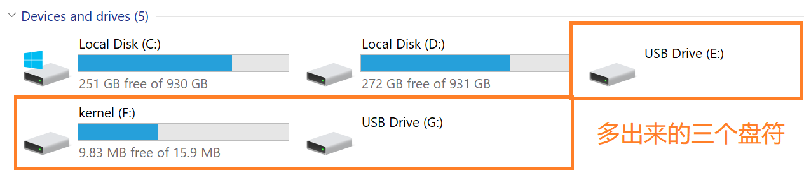

> 烧录后的U盘恢复为普通U盘的步骤：
>
> + CMD输入`diskpart`指令，进入到diskpart.exe界面
> + 输入`list disk`指令，查看所有磁盘，依据磁盘容量确定U盘的磁盘编号，格式为`Disk NUM`，其中`NUM`是具体的编号。
> + 输入`select disk NUM`指令，其中`NUM`需要替换为具体的磁盘编号。再次输入`list disk`指令，被选中的磁盘前面有`*`号。
> + 输入`clean`指令，清除磁盘分区。（此时可能会有弹窗提示 *Please insert a disk into USB Drive*，关闭该弹窗即可）
> + 输入`create partition primary`指令，此时会弹窗提示需要格式化U盘，若未弹窗手动双击U盘图标也可。
> + 格式化U盘时所有选项保持默认即可，格式化完毕之后就能正常使用了。

#### 5.1.2 VMware虚拟机配置

以管理员模式运行VMware。创建新虚拟机的步骤与前述步骤相同，到了 *选择磁盘* 界面的时候，选择第三项：使用物理磁盘。选择物理磁盘设备时，再次使用`diskpart`->`list disk`，依据磁盘容量确定U盘的 PhysicalDrive 编号。下面的 *使用情况* 选项选择使用整个磁盘。

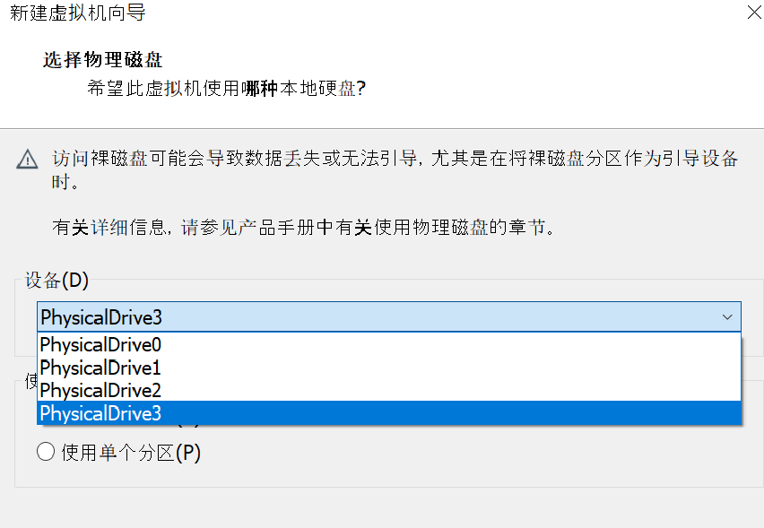

选择完物理磁盘后按提示创建一个`.vmdk`格式的磁盘文件，该文件将储存U盘的分区信息。

最后添加一个桥接主网卡的网络适配器，完成虚拟机创建。

#### 5.1.3 系统启动

运行虚拟机时从VMware左侧的虚拟机列表找到该虚拟机选项卡，右键选择：电源->打开电源时进入固件。这样开机启动时会直接进入BIOS界面。

在BIOS主界面使用方向键切换至 Boot 选项卡，记录此时默认的启动优先级顺序。然后依据界面上的操作提示使用方向键和`+`、`-`键调整各启动项优先级，需要将U盘调整为最高优先级启动。

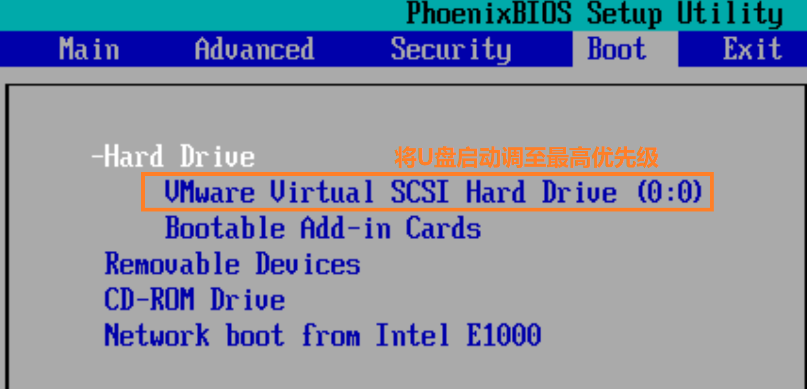

调整完启动优先级后切换至 Exit 选项卡，选择 Exit Saving Changes。此时就进入U盘中的系统启动环节。

#### 5.1.4 系统转移

使用`vim /ect/config/network`指令编辑eth0的IP地址，使其不与当前网络环境中的某个IP地址冲突。注意当前在这个系统中做的所有设置都会保存在U盘中，比如配置的系统密码、接口和防火墙设置等，都不会储存在`.vmdk`格式的本地磁盘文件中。因此需要将U盘中的系统完整转移至本地文件。

在宿主机里面打开CMD控制台，使用`scp`指令将`.img`映像文件上传至OpenWrt的`/tmp/`文件夹下。指令格式是`scp LOCAL_FILE_PATH REMOTE_HOST_NAME@IP:DEST_PATH`。

> 上述指令中`LOCAL_FILE_PATH`是需要上传的文件的完整路径，`REMOTE_HOST_NAME`是远程主机的用户名，此处实际为`root`，`IP`是之前修改的eth0的IP地址，`DEST_PATH`是上传的目的路径，此处实际为`/tmp/`。

之前创建的`.vmdk`文件已经储存有U盘的分区信息，因此需要创建一个新的虚拟磁盘。

右击虚拟机选项卡选择：设置->添加->硬盘->SCSI->创建新虚拟磁盘，虚拟磁盘容量可以自行设定一个合适的大小，此处将虚拟磁盘大小设定为了1GB。

使用`dd`指令进行写盘操作。指令格式是`dd if=INPUT_FILES of=OUTPUT_FILES`。

> 上述指令中`INPUT_FILES`是输入文件路径，此处实际为之前通过`scp`指令上传的`.img`映像文件完整路径，`OUTPUT_FILES`是输出文件路径，此处实际为之前新创建的`.vmdk`磁盘文件在OpenWrt系统中对应的设备名称，在绝大部分情况下是`/dev/sdb`。
>
> 保险起见需要用到`fdisk`指令查看设备名称。但是OpenWrt不能原生支持`fdisk`指令，需要再为OpenWrt设定网关和DNS使其能访问外部网络（注意还要关闭lan口的dhcp服务），再使用`opkg update && opkg install fdisk`指令，这样就可以安装`fdisk`。
>
> 使用`fdisk -l`指令，查看设备名称。可以依据磁盘容量来区分需要用作输入和输出的虚拟磁盘。
>
> 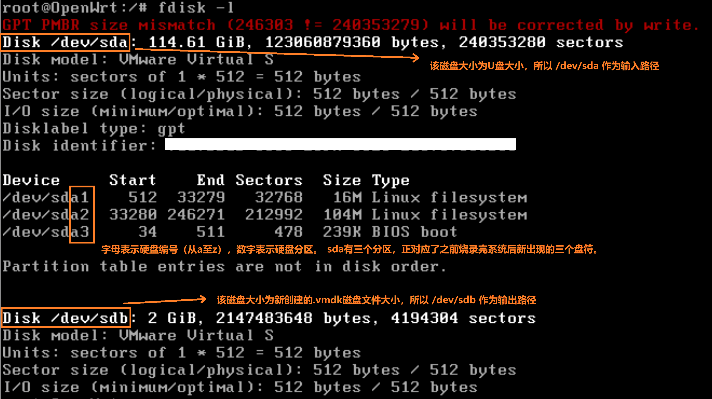
>
> 由上图的结果，输入指令`dd if=/tmp/OpenWrt.img of=/dev/sdb`。

待看到`xxx records in`，`xxx records out`的提示后表示OpenWrt系统已从U盘复制至新创建的`.vmdk`本地磁盘文件中。此时可以使用`poweroff`指令关闭系统并拔掉U盘。

进入虚拟机设置界面，移除U盘对应的硬件设备（点选时会提示 *系统找不到指定的文件*，因为此时已经拔掉U盘）。移除之后重新进入BIOS界面，还原回默认的启动优先级。
