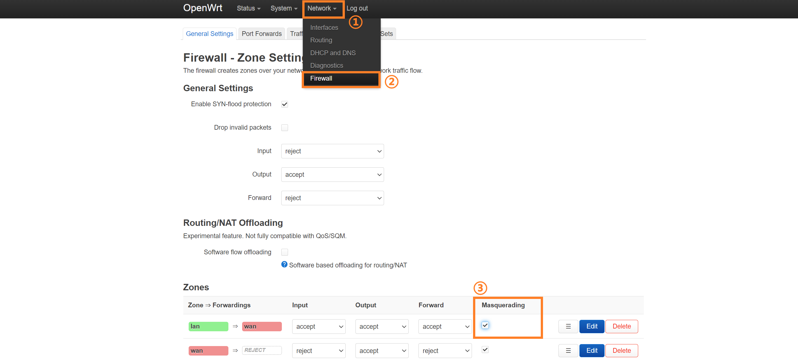

# 虚拟机下的OpenWrt指南

## 0_简介

OpenWrt是一个基于Linux的开源路由系统，选择OpenWrt的理由主要有两点：

1. 需要一个能接管所有本地流量的**透明代理**。

   Windows客户端常用的代理软件如CFW(*Clash for Windows*)等，其在未开启`tun`模式下通常只能代理网页流量，而不能代理绝大部分软件的流量。最常见的情况就是使用CMD控制台执行`pip install`指令安装Python包时下载速度很慢，使用`git push`指令时经常上传失败等等，这些都是流量没有被接管的体现。如果有一个能够接管全部本地流量的透明代理将不会出现上述问题。

2. 需要一个能**高度客制化**网络管理的系统。

   OpenWrt的自由度极高，能从各个细节客制化网络管理，比如DNS转发、负载均衡、流量分流等，也有各类丰富的插件可以即拿即用，比如屏蔽网页端广告、解锁音乐播放软件灰色曲目等。

使用OpenWrt系统最好是购买Cpu和网卡都达标的路由硬件，但是这类路由器价格普遍较高，如果选可扩展性强的x86架构路由器，还需要再单独加装硬盘、内存、wifi网卡，这也带来了额外的成本。

如果想零成本体验之后再购买硬件，那么最好的选择就是将OpenWrt安装在虚拟机里模拟操作一遍。其实如果不介意长时间开启电脑主机的话，也完全可以把虚拟机OpenWrt当作主力路由来使用。

本文所用的虚拟机平台是VMware，所有软件及固件都采用当前最新版本。

虚拟机安装OpenWrt可以有三种网络结构：

1. 仅使用Lan的旁路网关
2. 使用Lan->Wan的路由
3. 使用Lan->Wan的路由级联

以上三种网络结构安装难度逐渐递增，且都存在非常多的暗坑。下面将具体讲解安装步骤。~~（不需要深入了解具体原理，照着操作就不会出问题，大概）~~

## 1_共通准备

前述三种网络结构都有共通的需要准备的部分：

+ 下载OpenWrt固件
+ 转换OpenWrt固件格式
+ 下载VMware虚拟机

### 1.1_下载OpenWrt固件

[固件地址](https://downloads.openwrt.org/releases/ "https://downloads.openwrt.org/releases/")

下拉下载页面到最底端，找到如图所示的最新发行版。

进入`/targets/x86/64/`，选择第一项下载。

用7z解压得到一个`img`格式的映像文件。

> 注意：使用7z解压时可能会报错: *有效数据外包含额外数据 : openwrt-23.05.3-x86-64-generic-ext4-combined-efi.img*。无视该报错。

### 1.2_转换OpenWrt固件格式

下载StarWind V2V Converter转换器，该转换器可以将`img`格式的映像文件转化为`vmdk`格式的磁盘文件。

[转换器地址](https://www.starwindsoftware.com/tmplink/starwindconverter.exe "https://www.starwindsoftware.com/tmplink/starwindconverter.exe")

运行StarWind V2V Converter转换器。

选择第二项 Local file。

选择之前下载的映像文件。

选择第一项 Local file。

选择第一项 VMDK。

选择第一项 VMware Workstation growable image。使用该选项创建出的磁盘文件是可扩容的。

然后直接选择 convert 就可以得到一个`.vmdk`后缀的磁盘文件。

### 1.3_下载VMware虚拟机

下载VMware Workstation Pro。当前最新版本为17。

[VMware下载地址](https://www.vmware.com/go/getworkstation-win "https://www.vmware.com/go/getworkstation-win")

在安装时使用key激活。~~（一个可用key: MC60H-DWHD5-H80U9-6V85M-8280D）~~

## 2_搭建仅使用Lan的旁路网关

该网络结构的优点是搭建方便，网络拓扑结构简单。缺点是如果宿主机只能连接WiFi，那么宿主机通信将和虚拟机内的OpenWrt通信冲突，导致宿主机无法正常上网，在同一个VMnet下的其他虚拟机可以正常上网。因此只推荐在**能够连接有线网线**的情况下使用这个网络结构。如果只能连接无线网络，则推荐直接跳转阅读[下一个](#3_搭建使用lan-wan的路由)网络结构。

### 2.1_设置VMware的VMnet

进入VMware后选择 编辑->虚拟网络编辑器->更改设置（需要管理员权限），进入如下图所示的VMnet设置界面。

该网络结构只需要一个VMnet子网，将VMnet 0设置为桥接模式，桥接网卡选项由默认的自动改为物理有线网卡。

### 2.2_安装虚拟机

将之前转换得到的vmdk文件放入一个新建文件夹中，该文件夹将用作虚拟机文件夹。

+ 选择 文件->新建虚拟机->自定义(高级)，下一步
+ 硬件兼容性选择最上面的一项（当前是Workstation 17.x），下一步
+ 安装来源选择稍后安装操作系统，下一步
+ 客户机操作系统选择Linux，版本选择其他Linux 5.x内核64位，下一步
+ 虚拟机名称自定，位置选择前述的新建文件夹，下一步

  > 注意：此时会给出警告（"指定位置似乎已包含现有虚拟机"），直接选择继续即可。

+ 处理器数量1，内核数量4即可，下一步

  > 只要满足处理器数量乘以内核数量小于宿主机处理器内核总数都可以。

+ 虚拟机内存1024MB即可，下一步
+ 选择不使用网络连接，下一步
+ SCSI控制器类型保持默认，即LSI Logic，下一步
+ 虚拟磁盘类型保持默认，即SCSI，下一步
+ 选择使用现有虚拟磁盘，下一步
+ 磁盘位置选择为前述的新建文件夹中的vmdk文件，下一步
+ 弹窗提示是否将现有虚拟磁盘转换为更新的格式，选择保持现有格式即可
+ 选择自定义硬件
  + 移除以下几个硬件：新CD/DVD，USB控制器，声卡，打印机
  + 选择 添加->网络适配器
  + 网络连接部分选择 自定义->VMnet0

硬件部分最终设置结果如下图。

*可选操作*：选择 编辑虚拟机设置->选项->高级->不为启用了 Hyper-V 的主机启用侧通道缓解。禁用测通道缓解后可以提高虚拟机性能。

### 2.3_设置OpenWrt

开启虚拟机，待其加载一段时间后按回车就进入虚拟机的主界面了。

> 注意：如果虚拟机界面在VMware中显示得特别小，就选择 查看->拉伸客户机->保持纵横比拉伸。

第一次进入时需要设置密码。输入`passwd`指令按照提示设置密码。

> 注意：OpenWrt虚拟机内如果要使用小键盘需要先用Numlock键解锁。

在进行下一步的操作之前需要先确定宿主机的ip地址。打开CMD命令提示行，输入`ipconfig`指令，找到之前设置桥接的物理有线网卡，确认其ip。如下图，我的宿主机ip地址是`192.168.1.234/24`，网关ip地址是`192.168.1.1`。

下面需要更改OpenWrt的Lan口ip地址。输入`vim /etc/config/network`指令进入vim编辑界面。

使用方向键（或`h` `j` `k` `l`键）将光标移动至下图所示处。

按`i`键即可开始输入内容，修改ip地址。Lan口ip地址的前三段与宿主机ip地址前三段保持一致，最后一段从1至254之间选择一个与宿主机网关所在局域网内所有设备ip地址最后一段都不同的数字，本文选择的是31。

修改完成之后按`Esc`，再输入`:wq`后按回车键，这样就保存并退出了。

输入`reboot`指令重启OpenWrt操作系统（或输入`service network restart`指令重启网络服务即可）。

### 2.4_进入LuCI主界面

打开宿主机浏览器，输入之前设置的OpenWrt Lan口ip地址。

如果看到以下界面就说明第一步成功了🎉

输入密码登录以后，选择 Network->Interface->Edit。

下面是Lan口的配置修改内容：

+ General Settings -> IPv4 gateway 修改为之前查看到的宿主机网关ip地址（即主路由Lan口的ip地址）
+ Advanced Settings -> Use custom DNS servers 推荐添加两个谷歌DNS，地址为`8.8.8.8`，`8.8.4.4`。

  > 这里设置的DNS地址负责所有进出OpenWrt Lan口的域名解析工作。包括解析OpenWrt自身需要访问的域名（比如执行`opkg`指令安装各种包时需要用到），也包括处理宿主机向OpenWrt发送的域名解析请求。

+ DHCP Server -> General Setup -> Ignore interface 勾选该项。

  > 所有DHCP服务交给主路由来完成。如果关闭了主路由的DHCP服务，则可以开启OpenWrt的DHCP服务，即两者只能开启其中一个。

## 3_搭建使用Lan->Wan的路由
