# 虚拟机下的OpenWrt指南

## 0 简介

OpenWrt是一个基于Linux的开源路由系统，选择OpenWrt的理由主要有两点：

1. 需要一个能接管所有本地流量的**透明代理**。

   Windows客户端常用的代理软件如CFW(*Clash for Windows*)等，其在未开启`TUN`模式下通常只能代理网页流量，而不能代理绝大部分软件的流量（这些软件不遵循系统代理设定）。最常见的情况就是使用CMD控制台执行`pip install`指令安装Python包时下载速度很慢，使用`git push`指令时经常上传失败，因无法代理UDP流量导致WebRTC泄露等等，这些都是流量没有被接管的体现。如果有一个能够接管全部本地流量的透明代理将不会出现上述问题。

2. 需要一个能**高度客制化**网络管理的系统。

   OpenWrt的自由度极高，能从各个细节客制化网络管理，比如DNS转发、负载均衡、流量分流等，也有各类丰富的插件可以即拿即用，比如屏蔽网页端广告、解锁音乐播放软件灰色曲目等。

使用OpenWrt系统最好是购买CPU和网卡性能都达标的路由器硬件，但是这类路由器价格普遍较高，如果选可扩展性强的x86架构路由器，还需要再单独加装硬盘和内存，这也带来了额外的成本。

如果想零成本体验之后再购买硬件，那么最好的选择就是将OpenWrt安装在虚拟机里模拟操作一遍。通过虚拟机模拟清楚操作流程之后，再切换到物理环境会非常容易上手。其实如果不介意一直将虚拟机运行在后台的话，也完全可以把虚拟机OpenWrt当作主力路由来使用。

本文所用的虚拟机平台是VMware Workstation Pro，所有软件及固件都采用当前最新版本，且所有安装源均采用官方源，不会使用第三方打包/整合的工具。

虚拟机安装OpenWrt可以采用两种网络结构：

1. 仅使用lan的旁路网关
2. lan-wan结构的路由

以上两种网络结构各有优缺点，下面将分别讲解安装步骤。写这篇笔记时所有操作步骤都是经过逐步复现的。附录部分是一些杂项内容的汇总，主要用于个人记录。

## 1 共通准备

为实现前述两种网络结构都有共通的需要准备的部分：

1. 下载OpenWrt固件
2. 转换OpenWrt固件格式
3. 下载VMware虚拟机
4. 安装虚拟机

### 1.1 下载OpenWrt固件

[固件地址](https://downloads.openwrt.org/releases/ "https://downloads.openwrt.org/releases/")

下拉下载页面到最底端，找到如图所示的最新发行版。


> 注意：OpenWrt从`22.03.0`版本开始，将配置防火墙的工具从`iptables`替换为了`nftables`。这两者的配置语法**不兼容**，会导致部分没有及时升级防火墙配置的插件无法运行在较新版本的OpenWrt系统上，比如网易的UU加速器插件，目前不支持`nftables`。如果有使用这类插件的需求，应当选择`21.02.7`及其之前的版本。

进入`/targets/x86/64/`，选择第一项下载。


> `ext4`与`squashfs`的区别主要在 rootfs (根文件系统)：
>
> + `squashfs`是**只读文件系统**，压缩格式；`ext4`是**完整读写系统**，未被压缩。
> + `squashfs`作为系统只读部分不可修改，相当于固件镜像原样，用户修改部分挂载在`/overlay`，所有设置修改、新安装软件等都写在这里；`ext4`可以直接修改`/etc`或安装软件包，和传统 Linux 类似。
>
> 因此对于OpenWrt系统的具体应用场景来说：
>
> + `ext4`可以扩展磁盘空间大小，而`squashfs`则不能。
> + `squashfs`可以使用重置功能恢复出厂设置，而`ext4`则不能。
>
> 鉴于本文安装OpenWrt是在虚拟机环境下，可以很方便地使用虚拟机快照功能来备份和恢复设置，因此采用`ext4`格式。如果是安装在x86架构的实体路由器硬件上也推荐尽可能使用`ext4`格式。
>
> 文件名其余后缀区别：
>
> |文件名|是否含引导|是否支持 UEFI|说明|
> | :--- |:---:|:---:|:---|
> |`generic-ext4-combined-efi.img.gz`|√|√|带 UEFI 启动支持的完整 ext4 系统镜像|
> |`generic-ext4-combined.img.gz`|√|×|只支持传统 BIOS 启动的完整 ext4 系统镜像|
> |`generic-ext4-rootfs.img.gz`|×|×|仅包含 root 文件系统部分，不可单独启动|

用解压工具解压得到一个`.img`格式的映像文件。

> 注意：使用7z解压时可能会报错: *有效数据外包含额外数据 : openwrt-23.05.3-x86-64-generic-ext4-combined-efi.img*。无视该报错即可。原因是压缩文件附带了 SHA 校验或签名信息。

### 1.2 转换OpenWrt固件格式

下载StarWind V2V Converter转换器，该转换器可以将`.img`格式的映像文件转化为`.vmdk`格式的虚拟机磁盘文件。

[转换器地址](https://www.starwindsoftware.com/tmplink/starwindconverter.exe "https://www.starwindsoftware.com/tmplink/starwindconverter.exe")

运行StarWind V2V Converter转换器：

+ Select the location of the image to convert: 选择第二项 Local file(File on the local machine)。
+ Source image: 选择之前下载的`.img`映像文件路径。
+ Select the location of the destination image: 选择第一项 Local file(File on the local machine)。
+ Select destination image format: 选择第一项 VMDK(VMware Virtual Machine Disk)。
+ Select option for VMDK image format: 选择第一项 VMware Workstation growable image。使用该选项创建出的磁盘文件是可扩容的。
+ 选择好目的路径之后直接 convert 就可以得到一个`.vmdk`后缀的磁盘文件。

### 1.3 下载VMware虚拟机

下载VMware Workstation Pro。当前最新版本为17。

[VMware下载地址](https://www.vmware.com/go/getworkstation-win "https://www.vmware.com/go/getworkstation-win")

在安装时使用key激活。~~（一个可用key: MC60H-DWHD5-H80U9-6V85M-8280D）~~

### 1.4 安装虚拟机

将之前转换得到的vmdk文件放入一个新建文件夹中，该文件夹将用作虚拟机文件夹。

+ 打开VMware，选择 文件->新建虚拟机->自定义(高级)
+ 硬件兼容性 选择最上面的一项（当前是Workstation 17.x）
+ 安装来源 选择稍后安装操作系统
+ 客户机操作系统 选择Linux，版本 选择其他Linux 5.x内核64位
+ 虚拟机名称 自定，位置 选择前述新建的文件夹

  > 注意：此时会给出警告（"指定位置似乎已包含现有虚拟机"），直接选择继续即可。

+ 处理器数量：1，每个处理器的内核数量：4

  > 只要满足处理器数量乘以内核数量小于宿主机处理器内核总数都可以。

+ 设置虚拟机内存：1024MB
+ 网络连接 选择不使用网络连接
+ SCSI控制器 选择LSI Logic
+ 虚拟磁盘类型 选择SCSI
+ 磁盘 选择使用现有虚拟磁盘
+ 现有磁盘文件 选择前述新建的文件夹中的vmdk文件路径

  > 此时会弹窗提示是否将现有虚拟磁盘转换为更新的格式，选择保持现有格式即可。

+ 选择自定义硬件，移除以下几个硬件：新CD/DVD，USB控制器，声卡，打印机
+ 完成创建，VMware左侧的虚拟机列表会出现新创建的虚拟机

*可选操作*：在虚拟机列表右击新创建的虚拟机标签卡，选择 设置->选项->高级，勾选 *不为启用了 Hyper-V 的主机启用侧通道缓解*。禁用测通道缓解后可以提高虚拟机性能。

## 2 搭建仅使用lan的旁路网关

该网络结构的优点是搭建方便，网络拓扑结构简单。缺点很多，因为这是一个不符合规范的**非对称网络结构**（指上行流量和下行流量可能不会经过同一路径）。在虚拟机内使用OpenWrt时，只推荐在宿主机**能够连接网线**的情况下采用这个网络结构。如果宿主机只能连接无线网络，则推荐直接跳转阅读[下一个](#3-搭建lan-wan结构的路由)网络结构。

> 当宿主机只能连接无线网络时，采用旁路网关结构会导致宿主机通信和虚拟机内的OpenWrt通信冲突，从而使得宿主机无法正常上网，即使将OpenWrt的lan口开启NAT也没有效果。

### 2.1 设置VMware的VMnet

进入VMware后选择 编辑->虚拟网络编辑器->更改设置（需要管理员权限），进入如下图所示的VMnet设置界面。

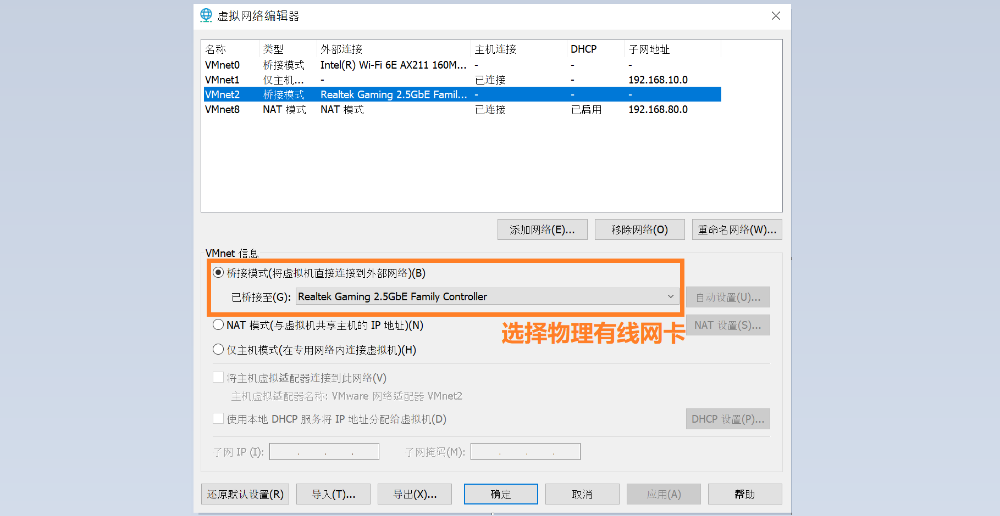

该网络结构只需要用到一个VMnet子网。本文使用的是VMnet2，这里将其设置为桥接模式，桥接网卡选项由默认的自动改为物理有线网卡。

### 2.2 设置虚拟机网卡

在VMware左侧的虚拟机列表右击虚拟机标签卡，选择 设置->硬件->添加->网络适配器。


如上图，在右侧的网络连接部分选择自定义，并选择之前设置为桥接模式的VMnet子网。

### 2.3 设置OpenWrt

开启虚拟机，待其加载一段时间后按回车键就进入虚拟机的主界面了。

> 注意：如果虚拟机界面在VMware中显示得特别小，就选择 查看->拉伸客户机->保持纵横比拉伸。


第一次进入时需要设置密码。输入`passwd`指令按照提示设置密码。

> 注意：OpenWrt虚拟机内如果要使用小键盘需要先用Numlock键解锁。

在进行下一步的操作之前需要先确定宿主机的ip地址。打开CMD命令提示行，输入`ipconfig`指令，找到之前设置桥接的物理有线网卡，确认其ip。如下图，我的宿主机ip地址是`192.168.1.234/24`，网关ip地址是`192.168.1.1`。


下面需要更改OpenWrt的lan口ip地址。在OpenWrt内输入`vim /etc/config/network`指令进入vim编辑界面。

使用方向键（或`H` `J` `K` `L`键）将光标移动至下图所示处。


按`I`键即可开始输入内容，修改ip地址。lan口ip地址的前三段与宿主机ip地址前三段保持一致，最后一段从1至254之间选择一个与宿主机网关所在局域网内所有设备ip地址最后一段都不同的数字，本文选择的是31。

修改完成之后按`Esc`键，再输入`:wq`后按回车键，这样就保存并退出了。

输入`reboot`指令重启OpenWrt操作系统（或输入`service network restart`指令重启网络服务即可）。

### 2.4 进入LuCI主界面

打开宿主机浏览器，输入之前设置的OpenWrt lan口ip地址（本文是`192.168.1.31`）。

如果看到以下界面就说明第一步成功了🎉


输入密码登录以后，选择 Network->Interface->Edit。


下面是lan口的配置修改内容：

+ General Settings -> IPv4 gateway 修改为之前查看到的宿主机网关ip地址（即主路由lan口的ip地址）
+ Advanced Settings:

  + Use custom DNS servers 推荐添加两个谷歌DNS服务器，地址为`8.8.8.8`，`8.8.4.4`。

    > 这里设置的DNS服务器地址负责所有进出OpenWrt lan口的域名解析工作。包括解析OpenWrt自身需要访问的域名（比如执行`opkg`指令安装各种包时需要用到），也包括处理宿主机向OpenWrt发送的域名解析请求。

  + IPv6 assignment length 选择 disabled。

    > 这样可以禁用lan口的IPv6地址。若无使用IPv6的特殊需求都应当关闭IPv6，因为IPv6在透明代理中会引入不必要的问题。禁用该选项后 General Settings 选项卡界面会新出现IPv6地址和网关的设置选项，保持为空即可。

+ DHCP Server -> General Setup -> Ignore interface 勾选该项。

  > 这样可以关闭OpenWrt的DHCP服务，将所有DHCP服务交给主路由来完成。如果关闭了主路由的DHCP服务，则可以开启OpenWrt的DHCP服务，即两者只能开启其中一个。
  >
  > 如果选择使用OpenWrt的DHCP服务，则还应当关闭IPv6的下发，方法是选择 DHCP Server -> IPv6 Settings：RA-Service -> disabled，DHCPv6-Service -> disabled，NDP-Proxy -> disabled。

此外还推荐修改一项防火墙设置。选择 Network -> Firewall，勾选lan区域的`Masq`选项。

> 在OpenWrt里Masquerading等效于NAT。虽然给lan口开启NAT会形成网络结构里应当竭力避免的*双重NAT*，造成一定的性能损失，但是对于旁路网关这种非对称网络结构来说开启NAT可以模拟出对称网络结构，从而避免一些奇奇怪怪的疑难杂症，总的来说肯定是带来的好处大于缺点，这也算是不得已而为之。


### 2.5 使用OpenWrt

旁路网关结构使用OpenWrt核心是要让上网设备的网关和DNS服务器地址指向OpenWrt。为达到这一目的可以有两种方法，其一是在设备自身修改网关和DNS服务器地址，如果设备无法设定自身网关（比如电视盒子），就需要用到另一种方法，即修改主路由DHCP服务器下发的网关和DNS服务器地址。

方法一：

以Windows系统为例，选择有线网卡的以太网属性，为其设定一个合适的ip地址（这里选择的是`192.168.1.32`），并修改默认网关和DNS服务器为OpenWrt的lan口地址（即前文所述的`192.168.1.31`）。


方法二：

各品牌的路由器设置方法不同，以电信宽带赠送的WAT301路由器为例，选择 路由设置->DHCP服务器，即可修改DHCP服务器下发给设备的网关和DNS服务器地址。这样做的缺点是连接主路由的所有设备都会受到影响。


## 3 搭建lan-wan结构的路由

该结构是一个符合规范的**对称网络结构**。推荐尽量使用该结构。唯一的缺点是需要至少双网卡。不过本文是在虚拟机环境下实现，VMware可以添加十余个虚拟网卡，因此这个缺点也就可以忽略不计。相较于仅使用lan的旁路网关结构来说，使用lan-wan结构的路由有很多好处，最明显的就是在无线网络环境下，宿主机也能使用虚拟机里的OpenWrt来正常上网了。因此下文采用宿主机无线网卡作为给虚拟机OpenWrt提供网络的物理设备。

### 3.1 设置VMware的VMnet

进入VMware后选择 编辑->虚拟网络编辑器->更改设置（需要管理员权限），进入如下图所示的VMnet设置界面。


该网络结构需要用到两个VMnet子网（选择 添加网络 选项，可以添加VMnet子网）：

+ 将VMnet0设置为**桥接模式**(*bridge*)，桥接网卡选项由默认的自动改为物理无线网卡，VMnet0子网将作为OpenWrt的wan口区域。

+ 将VMnet1设置为**仅主机模式**(*host only*)，VMnet1子网将作为OpenWrt的lan口区域。将VMnet1网卡的DHCP服务选项关闭，因为DHCP服务将交给OpenWrt的lan口来实现。设置一个合适的子网IP，本文将VMnet1子网网段设置为`192.168.10.0`。

### 3.2 设置虚拟机网卡

在VMware左侧的虚拟机列表右击虚拟机标签卡，选择 设置->硬件->添加->网络适配器。


如上图，在右侧的网络连接部分选择自定义，并选择之前设置为仅主机模式的VMnet1子网。

再次添加网络适配器，并选择之前设置为桥接模式的VMnet0子网。

> 注意：**添加网络适配器的顺序不能颠倒**。OpenWrt默认eth1为wan口，eth0(及eth2，eth3...)为lan口。第一个添加的网络适配器为eth0，对应lan口；第二个添加的网络适配器为eth1，对应wan口。

### 3.3 设置OpenWrt

开启虚拟机，待其加载一段时间后按回车键就进入虚拟机的主界面了。

> 注意：如果虚拟机界面在VMware中显示得特别小，就选择 查看->拉伸客户机->保持纵横比拉伸。

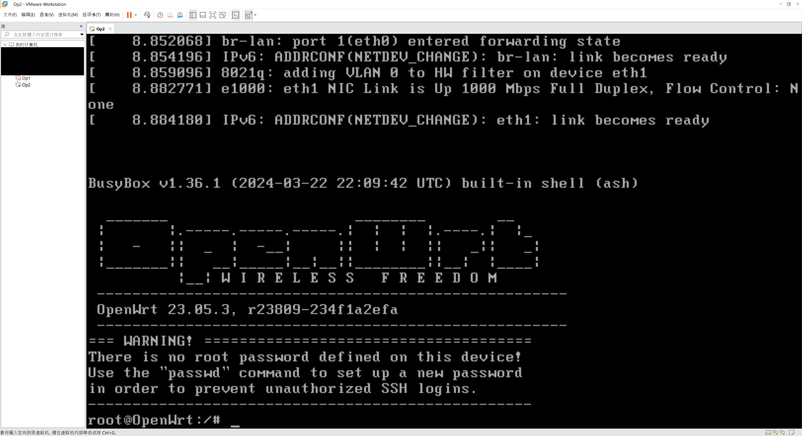

第一次进入时需要设置密码。输入`passwd`指令按照提示设置密码。

> 注意：OpenWrt虚拟机内如果要使用小键盘需要先用Numlock键解锁。

下面需要更改OpenWrt的lan口ip地址。在OpenWrt内输入`vim /etc/config/network`指令进入vim编辑界面。

使用方向键（或`H` `J` `K` `L`键）将光标移动至下图所示处。


按`I`键即可开始输入内容，修改ip地址。由于之前设置的VMnet1子网网段为`192.168.10.0`，因此这里可以将lan口的ip设置为`192.168.10.1`。

修改完成之后按`Esc`键，再输入`:wq`后按回车键，这样就保存并退出了。

输入`reboot`指令重启OpenWrt操作系统（或输入`service network restart`指令重启网络服务即可）。

由于OpenWrt的lan口默认开启了DHCP服务，因此宿主机的 *VMware Network Adapter VMnet1* 网卡此时应当被分配好了ip地址和网关。如果没有正确分配，将该网卡先禁用再启用即可。

### 3.4 进入LuCI主界面

打开宿主机浏览器，输入之前设置的OpenWrt lan口ip地址（本文是`192.168.10.1`）。

如果看到以下界面就说明第一步成功了🎉


输入密码登录以后，选择 Network->Interface，编辑wan口设置。


选择 Advanced Settings，取消勾选 Use DNS servers advertised by peer 选项。在取消勾选后会新出现一个 Use custom DNS servers 选项。推荐添加两个谷歌DNS服务器，地址为`8.8.8.8`，`8.8.4.4`。

> 这里设置的DNS服务器地址负责所有进出OpenWrt wan口的域名解析工作。包括解析OpenWrt自身需要访问的域名（比如执行`opkg`指令安装各种包时需要用到），也包括处理宿主机向OpenWrt发送的域名解析请求。

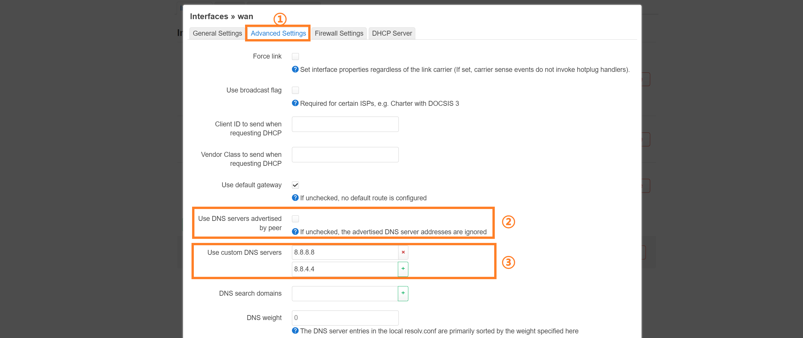

接下来建议禁用OpenWrt的IPv6功能。若无使用IPv6的特殊需求都应当关闭IPv6，因为IPv6在透明代理中会引入不必要的问题。以下是需要修改的设置：

+ 选择 Network -> Interface，删除wan6接口。

+ 选择 Network -> Interface，编辑lan接口。在lan接口的编辑界面：

  + 选择 DHCP Server -> IPv6 Settings：RA-Service -> disabled，DHCPv6-Service -> disabled，NDP-Proxy -> disabled。

  + 选择 Advanced Settings：IPv6 assignment length -> disabled。

    > 禁用该选项后 General Settings 选项卡界面会新出现IPv6地址和网关的设置选项，保持为空即可。

+ 选择 Network -> DHCP and DNS -> Filter，勾选 Filter IPv6 AAAA records。

### 3.5 使用OpenWrt

为了让OpenWrt接管宿主机的网络，不能简单地禁用宿主机无线网卡（因为宿主机的无线网卡需要给OpenWrt的wan口提供网络）。需要修改宿主机无线网卡的以太网属性。有两种修改方式：

1. 取消IPv4和IPv6协议。
2. 修改接口跃点数，将其指定为一个比较大的值。

这两种方式都是避免宿主机网卡直接产生网络通信，把网络通信的功能交给虚拟机网卡 *VMware Network Adapter VMnet1*。


方法一最稳妥，一定能让宿主机无线网卡无法网络通信，但是有个缺点是系统里的网络连接状态会显示为无连接，无法使用UWP应用和Windows商店。方法二只是把宿主机无线网卡的使用优先级降得很低，在OpenWrt工作失效的时候仍会采用宿主机无线网卡进行网络通信，比较不保险，但是这样不会让系统网络连接状态显示为无连接，可以正常使用UWP应用。具体采用哪种方式根据使用情况进行权衡。

### 3.6 **\*** 将虚拟机内的OpenWrt提供给其他设备使用

如果电脑同时有有线网卡和无线网卡，那么可以将无线网卡用来给OpenWrt的wan口提供网络，有线网卡用来桥接OpenWrt的lan口，这样将一个闲置路由器和电脑的有线网卡用网线连接之后，连接该路由器的设备也可以使用OpenWrt的网络。

再次打开虚拟网络编辑器，添加一个桥接物理有线网卡的VMnet子网。本文设置的是VMnet2子网。


给OpenWrt虚拟机新添加一个网络适配器，并选择之前设置为桥接物理有线网卡的VMnet2子网。（可以在OpenWrt正在运行的时候添加网络适配器。当OpenWrt检测到有新的网卡接入时会自动重启网络服务，即等效于自动执行`service network restart`指令）

在添加网络适配器后重新进入OpenWrt的LuCI设置界面。选择 Network -> Interface -> Devices，进入br-lan的设置界面。

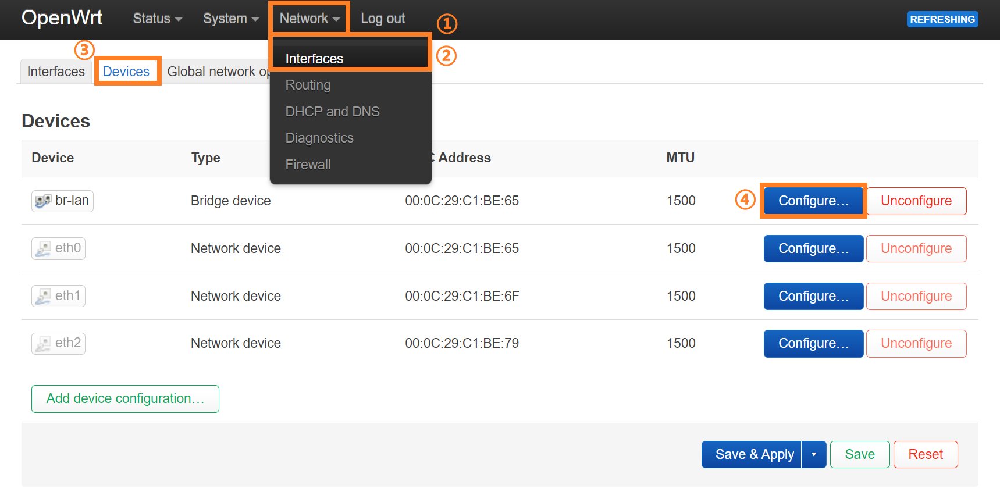

br-lan是一个抽象出来的桥接lan口，所有新添加的lan口网卡都应当加入br-lan的桥接设置中。在 General device options 选项卡下找到 Bridge ports，勾选新添加的eth2，这样就可以把原本的eth0和新添加的eth2桥接起来，它们共用br-lan这个抽象接口。

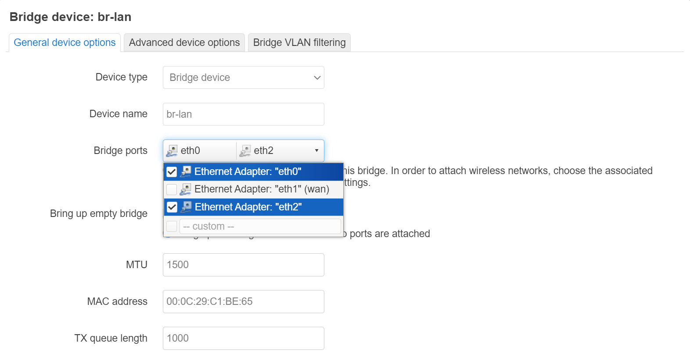

接下来需要设置路由器，需要将路由器从**路由模式**改为**AP模式**。各品牌的路由器设置方法不同，以电信宽带赠送的WAT301路由器为例，只需要关闭lan口DHCP服务就能将路由器改为AP模式，此时路由器的四个网口全部变成lan口。（注意如果路由器的lan口ip不是自动获取的状态，还需要再手动修改其ip地址，避免与OpenWrt的lan口ip冲突）


现在将路由器和电脑的有线网卡用网线连接起来，此时连接该路由器的所有设备都可以使用OpenWrt的网络了。

## 4 附录

### 4.1 直接使用.img文件安装系统的方法

直接使用`.img`格式的映像文件来安装系统，相较于 [1.2节](#12-转换openwrt固件格式) 所述使用转换软件将其转换成虚拟机磁盘格式`.vmdk`文件之后再使用的方法来说比较繁琐，但是如果想要将OpenWrt安装到实际的硬件环境上只能使用`.img`格式的映像文件，用虚拟机模拟一遍有助于增强理解。

#### 4.1.1 将.img文件烧录入U盘

首先需要将`.img`映像文件烧录入U盘中，用到软件balenaEtcher。（烧录时会格式化U盘，原来的所有储存信息都会丢失）

[Etcher下载地址](https://etcher.balena.io/#download-etcher "https://etcher.balena.io/#download-etcher")

选择 Flash from file 选项开始烧录。


完成烧录后会出现很多弹窗，提示需要格式化U盘，直接关闭这些弹窗，可以发现原来的U盘图标变成了一个名叫 Removeable Disk 的盘符。

现在将U盘拔下并重新连接至电脑，此时可以看见多了三个盘符，其中两个盘符双击后提示需要格式化，另一个名叫 kernel 的盘符可以直接双击打开，里面有efi文件。这样表示烧录成功。


> 烧录后的U盘恢复为普通U盘的步骤：
>
> + CMD输入`diskpart`指令，进入到diskpart.exe界面
> + 输入`list disk`指令，查看所有磁盘，依据磁盘容量确定U盘的磁盘编号，格式为`Disk NUM`，其中`NUM`是具体的编号。
> + 输入`select disk NUM`指令，其中`NUM`需要替换为具体的磁盘编号。再次输入`list disk`指令，被选中的磁盘前面有`*`号。
> + 输入`clean`指令，清除磁盘分区。（此时可能会有弹窗提示 *Please insert a disk into USB Drive*，关闭该弹窗即可）
> + 输入`create partition primary`指令，此时会弹窗提示需要格式化U盘，若未弹窗手动双击U盘图标也可。
> + 格式化U盘时所有选项保持默认即可，格式化完毕之后就能正常使用了。

#### 4.1.2 VMware虚拟机配置

以**管理员模式**运行VMware。创建新虚拟机的步骤与 [1.4节](#14-安装虚拟机) 相同，到了 *选择磁盘* 界面的时候，选择第三项：使用物理磁盘。选择物理磁盘设备时，再次使用`diskpart`->`list disk`，依据磁盘容量确定U盘的 PhysicalDrive 编号。下面的 *使用情况* 选项选择使用整个磁盘。


选择完物理磁盘后按提示创建一个`.vmdk`格式的磁盘文件，该文件将储存U盘的分区信息。

最后进入自定义硬件界面，移除不必要的硬件，然后添加一个桥接主网卡的网络适配器，完成虚拟机创建。

在完成虚拟机创建后，从VMware左侧的虚拟机列表找到该虚拟机选项卡，右击选择：设置->添加->硬盘->SCSI->创建新虚拟磁盘。在创建磁盘时设置一个合适的磁盘大小，此处选择设置为2GB。这样会新生成一个`.vmdk`磁盘文件，该文件用来储存预备从U盘转移的系统。

#### 4.1.3 启动系统

准备运行虚拟机时，右击虚拟机选项卡，选择：电源->打开电源时进入固件。这样开机启动时会直接进入BIOS界面。

在BIOS主界面使用方向键切换至 Boot 选项卡。


然后依据界面上的操作提示使用方向键和`+`、`-`键调整各启动项优先级，需要确保U盘启动优先级比当前为空的本地磁盘启动优先级高一级，否则会无法进入U盘中的系统。

调整完启动优先级后切换至 Exit 选项卡，选择 Exit Saving Changes。此时就进入U盘中的系统启动环节。

#### 4.1.4 转移系统

使用`vim /ect/config/network`指令编辑eth0的IP地址，使其不与当前网络环境中的某个IP地址冲突。修改完后使用`service network restart`指令重启网络服务。注意当前在这个系统中做的所有设置都会保存在U盘中，比如配置的系统密码、接口和防火墙设置等，都不会储存在`.vmdk`格式的本地磁盘文件中。因此需要将U盘中的系统完整转移至本地文件。

在宿主机里面打开CMD控制台，使用`scp`指令将`.img`映像文件上传至OpenWrt的`/tmp/`文件夹下。指令格式是`scp LOCAL_FILE_PATH REMOTE_HOST_NAME@IP:DEST_PATH`。

> 上述指令中`LOCAL_FILE_PATH`是需要上传的文件的完整路径，`REMOTE_HOST_NAME`是远程主机的用户名，此处实际为`root`，`IP`是之前修改的eth0的IP地址，`DEST_PATH`是上传的目的路径，此处实际为`/tmp/`。
>
> 如果使用`scp`指令报错`ash: /usr/libexec/sftp-server: not found`，说明宿主机的 scp 版本太新，在底层使用的是 sftp 作为协议。此时加上`-O`(**Old**)选项即可。即`scp -O LOCAL_FILE_PATH REMOTE_HOST_NAME@IP:DEST_PATH`。或是执行`opkg update && opkg install openssh-sftp-server`，为其安装上 sftp 服务器。

使用`dd`指令进行写盘操作。指令格式是`dd if=INPUT_FILES of=OUTPUT_FILES`。执行完`dd`指令后，需再执行`sync`指令，确保内核缓冲区中所有未写入磁盘的数据完整写入磁盘。

> 上述指令中`INPUT_FILES`是输入文件路径，此处实际为之前通过`scp`指令上传的`.img`映像文件完整路径，`OUTPUT_FILES`是输出文件路径，此处实际为之前新创建的`.vmdk`磁盘文件在OpenWrt系统中对应的设备名称，在绝大部分情况下是`/dev/sdb`。
>
> 保险起见需要用到`fdisk`指令查看设备名称。但是OpenWrt不能原生支持`fdisk`指令，需要再为OpenWrt设定网关和DNS使其能访问外部网络（注意还要关闭lan口的dhcp服务），再使用`opkg update && opkg install fdisk`指令，这样就可以安装`fdisk`。
>
> 使用`fdisk -l`指令，查看设备名称。可以依据磁盘容量来区分需要用作输入和输出的虚拟磁盘。
>
> 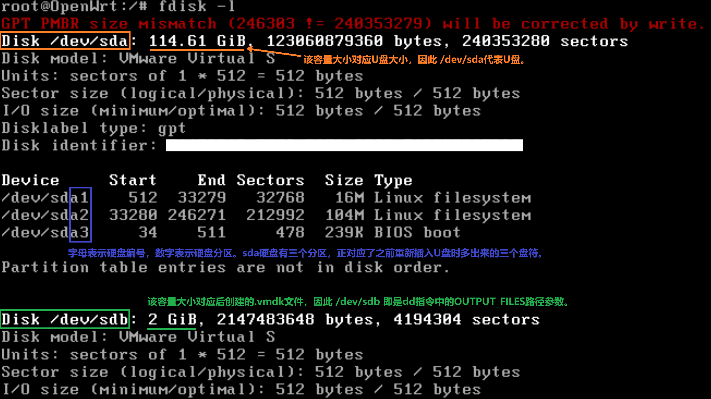
>
> 由上图的结果，输入指令`dd if=/tmp/OpenWrt.img of=/dev/sdb`。（`OpenWrt.img`需要换成实际的文件名称）

待看到`xxx records in`，`xxx records out`的提示后表示OpenWrt系统已从`.img`映像文件复制至后创建的`.vmdk`本地磁盘文件中。此时可以使用`poweroff`指令关闭系统并拔掉U盘。

进入虚拟机设置界面，移除U盘对应的硬件设备（点选时会提示 *系统找不到指定的文件*，因为此时已经拔掉U盘，直接关闭该提示即可）。

此时重新进入的系统即是从`.img`映像文件完整复制而来的纯净系统，需要再重新配置eth0的IP地址后方可通过该IP登录OpenWrt系统的luci界面，从而继续进行后续的配置工作。

#### 4.1.5 系统扩容

在 luci web 界面以及使用`fdisk -l`指令可以看到，当前 OpenWrt 系统可使用的磁盘储存空间约为100M，远不及[4.1.2节](#412-vmware虚拟机配置)创建硬盘2时设定的2GB，这是因为 OpenWrt 镜像默认分区布局未利用全部磁盘空间，需要按需手动扩容。

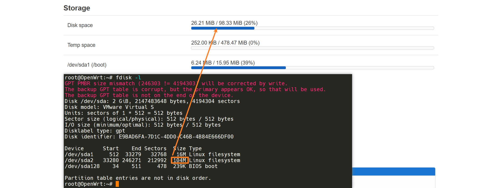

由于需要扩容的分区为已挂载的根分区，因此采用离线扩容的方式。

重新给虚拟机添加硬盘，设置之前的U盘为硬盘2。选择：电源->打开电源时进入固件，修改 BIOS 里的启动优先级，优先启动U盘中的系统。

> 注：当前版本下更改虚拟机 BIOS 中的启动优先级并不能完全确保 VMware 按照指定的优先级进行启动。如果没有进入到U盘中的系统，可以在 硬盘->高级 选项中把U盘设置为 **SCSI 0:X**，把本地磁盘设置为 **SCSI 0:Y**，其中`X`和`Y`都与原来的值不一致，且`X`比`Y`小。调整U盘启动优先级比本地磁盘启动优先级高一级，再次进入系统。
>
> 注2：物理设备中不存在这种情况，会严格按照 BIOS 中设定的启动优先级进行启动。

进入系统后执行`fdisk -l`，确认需要 resize 的设备为`/dev/sdb2`。

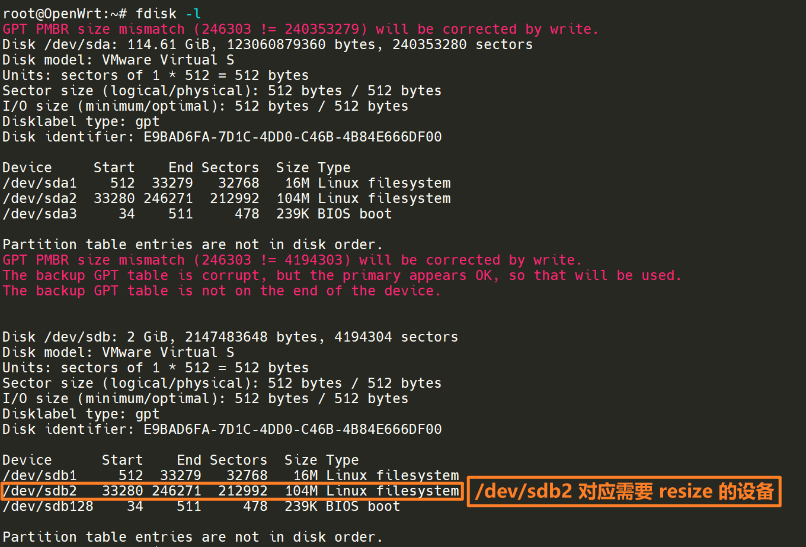

执行`fdisk /dev/sdb`指令。在`fdisk`的交互界面输入如下指令：

```python
p           ← 打印当前分区表
e           ← 扩充分区
2           ← 扩充 /dev/sdb2
[Enter]     ← 使用默认值
w           ← 写入并退出
# q         ← 直接退出
```


> fdisk 的 e 指令(即 resize 指令)在 fdisk (util-linux 2.39) 版本下不支持，在 fdisk (util-linux 2.40.2) 及以上版本支持。如果 fdisk 版本不支持，就使用 parted 扩容。

目前完成了给磁盘分区扩容，还没有给磁盘分区上的文件系统扩容。

> 给文件系统扩容的`resize2fs`指令不能对已挂载的根分区在线执行，需要在另一块磁盘中刷入OpenWrt系统，再在新刷入的系统中执行（这样相对于完成分区扩容的磁盘来说是离线执行）。

执行`opkg update && opkg install resize2fs`，再执行`resize2fs /dev/sdb2`。

看到如下报错信息，说明需要扩容的文件系统格式有损坏，需要执行`e2fsck`指令来强制检查文件系统完整性并修复错误。

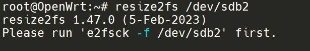

`e2fsck`指令不需要再额外安装依赖，直接执行即可。在执行完`e2fsck -f /dev/sdb2`指令后，继续执行`resize2fs /dev/sdb2`指令。看到 *The filesystem on /dev/sdb2 is now 520123 (4k) blocks long* 的提示说明已扩容完毕。其中 4k 表示每个块(**block**)的大小，520123表示块的总数。这两者的乘积就是[4.1.2节](#412-vmware虚拟机配置)创建硬盘2时设定的磁盘容量2GB。


此时移除U盘，重新进入本地磁盘中的系统，能够顺利进入系统。

> 另一种给磁盘分区扩容的方法是使用`parted`。
>
> 执行`opkg update && opkg install parted`，安装完毕后执行`parted`指令。
>
> 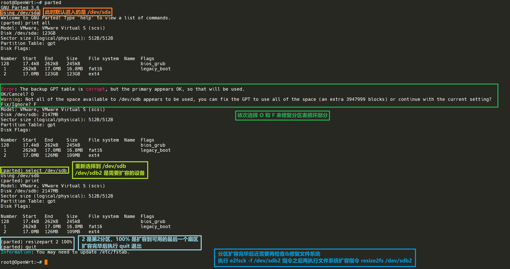
> > 注：部分版本的 parted 扩容指令是`resize`而不是`resizepart`，使用前最好用`help`指令查看一下具体的扩容指令。

### 4.2 wan和lan的实质

OpenWrt的wan口和lan口实质区别就是**防火墙配置**不同。只要更改相应的防火墙配置，就能实现wan和lan的互相转换。

路由的核心是**转发**（*Forward*），而不是NAT。这里的转发是指当指定网关的访问请求及DNS查询请求等无法在本区域（*Zone*）实现时就会将请求转发给OpenWrt内其他区域。

下面将以 [2.4节](#24-进入luci主界面) 设置完毕的OpenWrt系统为基础讲解如何实现wan和lan的互相转换。

首先为该虚拟机添加一个新的网络适配器，选择前述的VMnet1子网(host only模式)，该网卡将用作lan口。而原先用作lan口、桥接宿主机无线网卡的VMnet2将用作wan口。添加网络适配器后OpenWrt自动执行`service network restart`。

浏览器访问`192.168.1.31`，进入LuCI设置界面。由于仅从LuCI设置界面无法将已经创建好的接口更改名字，因此选择在 Interfaces 选项卡界面删除lan接口，然后再重新创建接口。

首先创建wan接口，该接口用到eth0，协议为DHCP客户端，这样可以自动获取主路由分配的ip和网关。

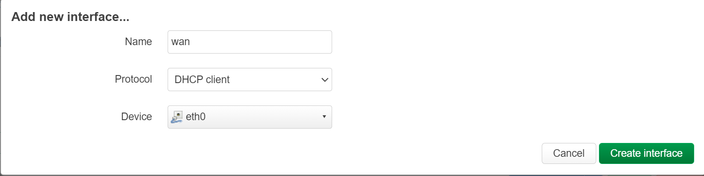

创建完wan接口后自动进入接口的设置界面。在 Advanced Settings 选项卡界面取消勾选 Use DNS servers advertised by peer 选项，然后在 Use custom DNS servers 输入框中输入DNS服务器地址`8.8.8.8`和`8.8.4.4`。

在 FireWall Settings 选项卡界面选择防火墙区域为预设的wan。

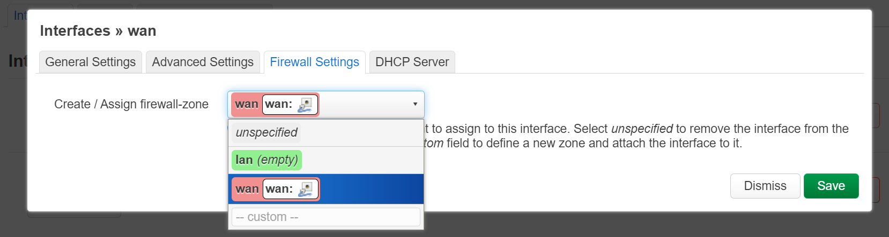

其他选项保持默认，完成wan接口的创建和设置。

> 注意：此时不要在LuCI界面选择 Save & Apply，因为预设的wan区域拒绝输入(*Zone ⇒ Forwardings* 的 *input* 属性为 *reject*)。要在完成lan接口的创建和设置之后才能保存并应用。

接下来创建lan接口，该接口用到eth1，协议为 Static address。

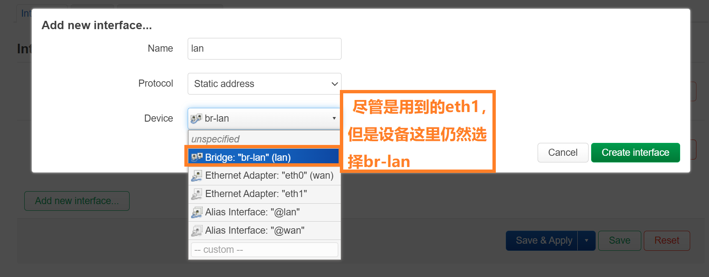

创建完lan接口后自动进入接口的设置界面。需要先设置lan的ip和子网掩码。由于VMnet1的网段是`192.168.10.0`，因此lan可以设置为`192.168.10.1/24`。网关保持为空，因为从lan到wan的通信是转发，在防火墙设置里Zone lan和Zone wan之间已经默认开启了Forward权限。


同理，在 Advanced Settings 选项卡界面下的 Use custom DNS servers 也保持为空即可，当连接lan接口的设备发起DNS请求时该请求会被直接转发给wan接口处理。

在 FireWall Settings 选项卡界面选择防火墙区域为预设的lan。


在 DHCP Server 选项卡界面选择 Set up DHCP Server。由于 IPv6 assignment length 选项在新建接口的时候默认为disabled，因此 DHCP Server -> IPv6 Settings 下的RA-Service、DHCPv6-Service和NDP-Proxy默认为disabled，不需要再做额外修改。

完成lan接口的创建和设置之后，进入 Interfaces 右边的 Devices 选项卡界面，修改br-lan设置。由于互换了lan和wan，因此需要在 Bridge Ports 选项取消勾选eth0并勾选eth1。

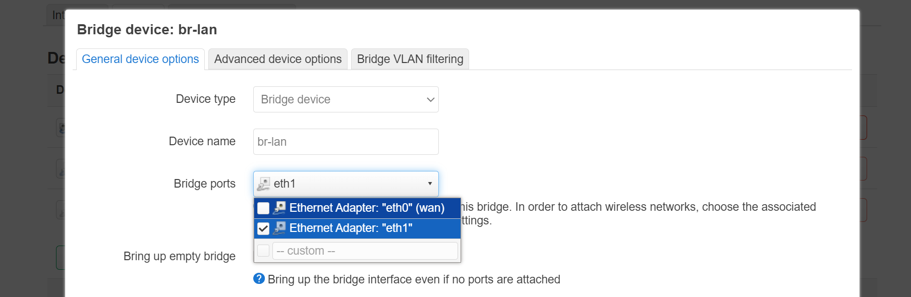

最后在LuCI主界面选择 Save & Apply。由于lan的网段从原来的`192.168.1.0`更改为了`192.168.10.0`，因此会弹出如下警告。


直接选择应用并保存设置即可。此时在浏览器界面访问`192.168.10.1`就能再重新看到LuCI界面，这样就表示设置成功了。

下面做一项实验。

在wan接口 Use custom DNS servers 选项删除之前设置的DNS服务器，使该项为空，同时保持 Use DNS servers advertised by peer 选项为取消勾选状态。在lan接口设置DNS服务器为`8.8.8.8`和`8.8.4.4`。

保存并应用之后，在OpenWrt内输入`ping baidu.com`。发现百度域名被解析为IP地址`39.156.66.10`。这是因为wan口DNS请求被转发给了lan来处理。

接下来进入lan区域的防火墙设置，取消勾选转发至wan区域的转发权限。


在lan区域取消从lan至wan的转发权限后，wan区域会自动取消从lan至wan的转发权限。设置完后如下图所示。


保存并应用之后在OpenWrt内使用`reboot`指令重启，这样可以清除DNS缓存。重新输入`ping baidu.com`。发现百度域名被解析为IP地址`110.242.68.66`，因为此时wan无法处理DNS请求，也无法将该请求转发给lan，只能输出(*Output*)给wan的网关（即主路由）。主路由的DNS服务器设置是由电信运营商下发的，所以最终解析出来的IP地址和谷歌DNS服务器解析出的IP地址不同。

然后给wan接口添加DNS服务器`8.8.8.8`和`8.8.4.4`。重新输入`ping baidu.com`。发现百度域名又重新被解析为IP地址`39.156.66.10`，这说明DNS请求由wan口来处理，而不是交给上级的主路由处理。

### 4.3 更换VMware虚拟机网卡驱动

使用lan-wan结构的路由进行测速时经常会在测速几秒钟之后卡顿一下，然后OpenWrt内log显示`e1000 detected Tx Unit Hang`，应该是网卡端口短时间传输大量数据时发生阻塞。为了避免这种现象的发生需要把`e1000`驱动更换为`vmxnet3`驱动。

右击虚拟机选项卡，选择打开虚拟机目录，找到后缀为`.vmx`的文件并用文本编辑工具打开，找到`ethernet[N].virtualDev = "e1000"`，修改为`ethernet[N].virtualDev = "vmxnet3"`。（可以直接全局搜索`e1000`然后替换为`vmxnet3`）

### 4.4 实体路由采用旁路网关结构的弊端

如果设备是用wifi连接到主路由，那么必须要开启旁路网关lan口的NAT（即勾选 Masquerading 选项），否则会导致设备无法正常访问网页。

### 4.5 OpenWrt安装绿联USB网卡驱动

从 [绿联官网](https://www.lulian.cn/download/list-34-cn.html "https://www.lulian.cn/download/list-34-cn.html") 查到绿联USB/Type-C千兆网卡芯片型号为AX88179。

在 [OpenWrt官网的kernel mods列表](https://openwrt.org/packages/index/kernel-modules "https://openwrt.org/packages/index/kernel-modules") 中直接搜索AX88179，得到其kmod包全称为`kmod-usb-net-asix-ax88179`。

接下来进入OpenWrt，输入指令`opkg update && opkg install kmod-usb-net-asix-ax88179`安装USB网卡驱动。这样绿联的USB网卡就能在OpenWrt系统里正常使用。实测将此USB网卡插在古董笔记本惠普暗影精灵2pro上面可以跑到900+Mbps，接近千兆网速上限。

如果老式电脑有USB3.0接口，但是网卡只有百兆上限，就可以购买绿联的USB千兆网卡，然后用 [4.1节](#411-将img文件烧录入u盘) 所述的方法让老式电脑运行上OpenWrt系统，安装好网卡驱动之后就可以把老式电脑变成一台真正的路由器，这样就不需要再额外购买x86架构的软路由。

### 4.6 OpenWrt防火墙配置说明

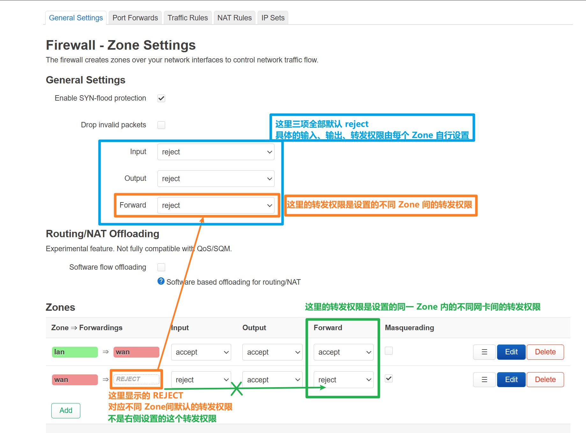


### 4.7 OpenWrt安装UU加速器插件

UU加速器插件目前已支持nftables。

ssh连接OpenWrt后输入以下指令：

```sh
wget https://uurouter.gdl.netease.com/uuplugin-script/openwrt/install/v2/install.sh
/bin/sh install.sh openwrt $(uname -m)
# 若没有安装 kmod-tun 需要执行以下指令:
# (若安装有 OpenClash 等插件应该已安装好了 kmod-tun 前置)
opkg update && opkg install kmod-tun
```

在UU加速器的手机app上选择安装路由器插件，并依照引导操作，然后就能通过手机app来控制路由器里的UU加速器开关及节点选择。

注意此时即使游戏设备连接上加速器也无法访问网络，还需要修改防火墙设置。

> 连接加速器这一步是为了让 OpenWrt 系统中识别到 `tun163` 这个设备，以便于进行后续的防火墙设置环节。
>
> 注：如果连接了两台游戏设备，OpenWrt 中会出现 `tun163` 和 `tun164` 两个设备。

新建防火墙 Zone，命名为 UU。修改 Input 和 Output 设置，都改为 accept。再修改区域间转发设置，允许转发至(**forward to**)和转发自(**forward from**)当前的 lan Zone。

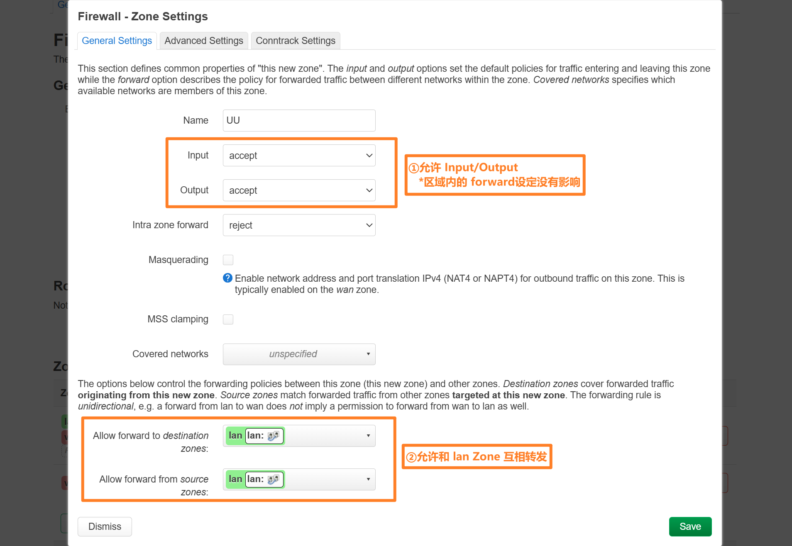

接下来绑定 UU 的 tun 设备到 UU Zone。

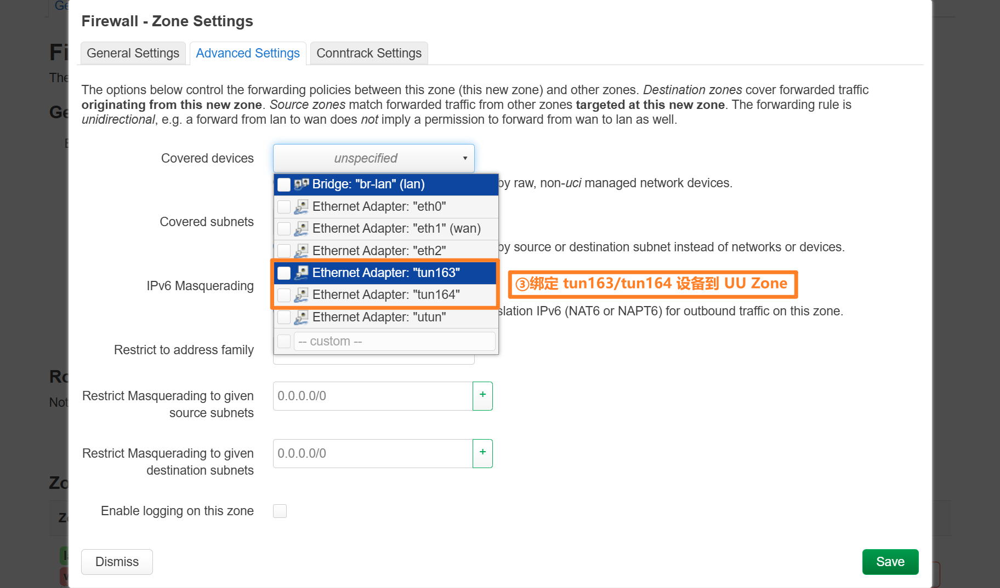

下面是防火墙设置成功的界面。


更新防火墙设置后游戏设备就能成功联网了。

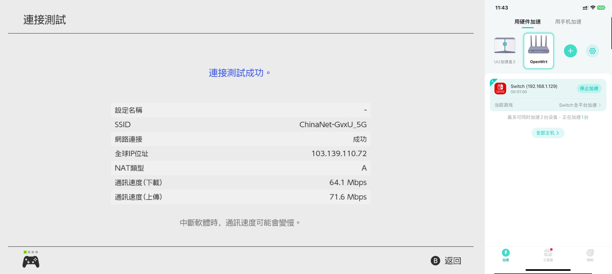

> 开启UU加速器时也可以保持 OpenClash 开启，只要确保不在UU加速器生效中时关闭或开启 OpenClash 即可。

### 4.8 OpenWrt安装Openclash插件

安装过程中如果报错：*opkg_install_cmd: cannot install package dnsmasq-full*，说明想要安装的 dnsmasq-full 和本地已有的 dnsmasq 冲突，需要先卸载本地的 dnsmasq。

执行指令`opkg remove dnsmasq && opkg install dnsmasq-full`，确保卸载 dnsmasq 和安装 dnsmasq-full 同时进行。

***


