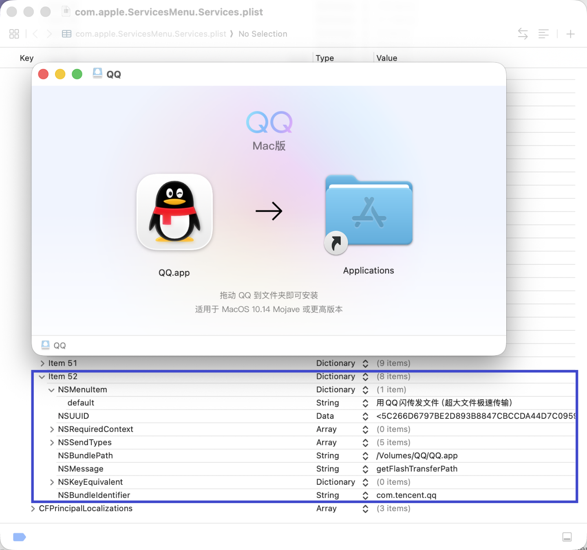
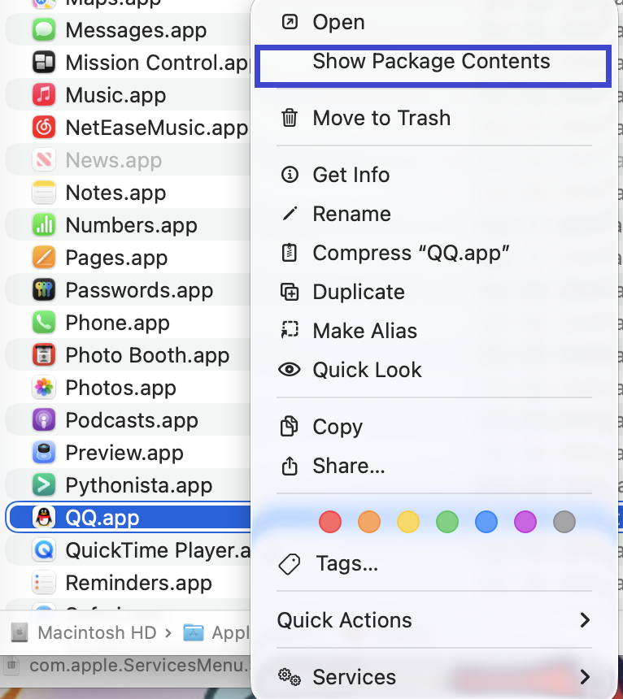
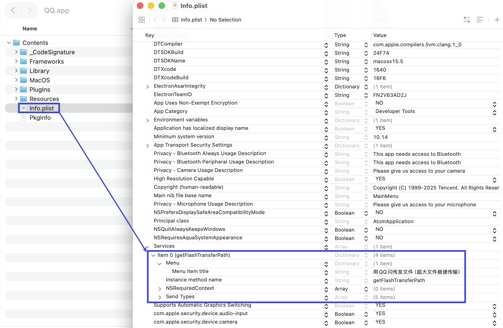
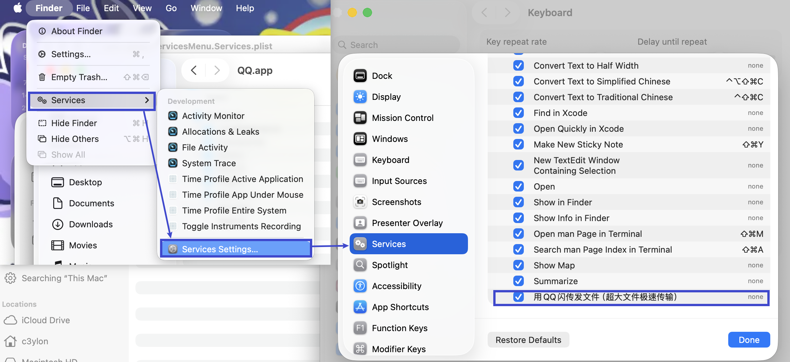
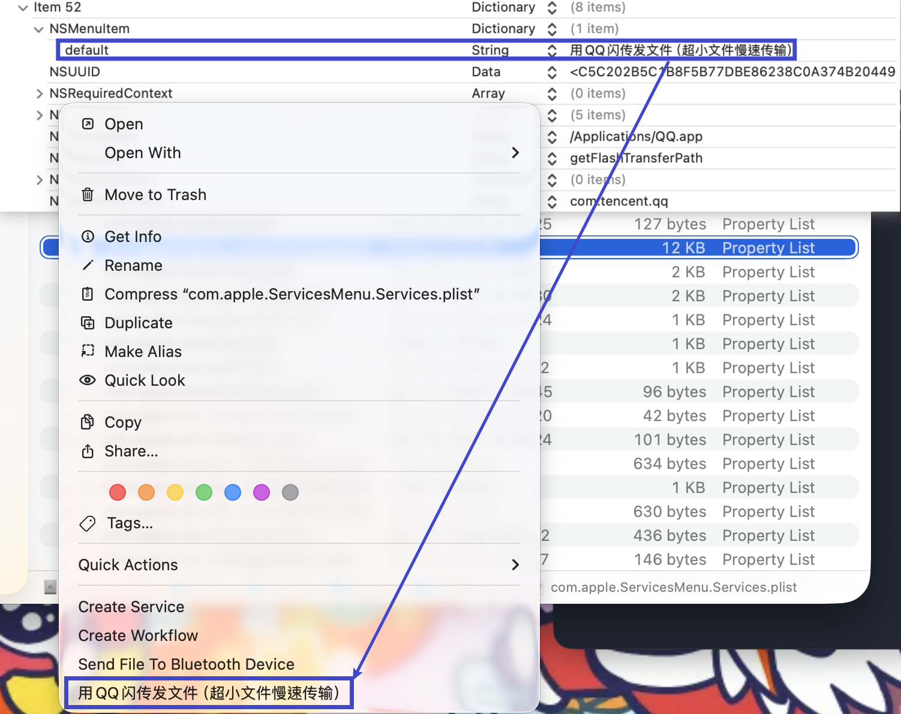

# MAC Notes

macos在finder中查看所有文件的方法：快捷键`command`+`shift`+`.`，通过使用这组快捷键可以看到`.`开头的隐藏文件或其他非以`.`开头的系统隐藏文件(`\opt`等)。

***

macos中与配置信息有关的内容存放在`.plist`后缀的文件中(*preference list*)。

在将QQ的dmg文件挂载到系统中时（此时还没有开始安装程序），会发现`~/Library/Preference`路径下的`com.apple.ServicesMenu.Services.plist`配置文件被加入了新的配置项：



这是因为QQ的app文件中存在`./Contents/Info.plist`文件，且该文件中定义了`Services`字段。在挂载dmg文件时，系统自动将相关配置信息注册到**pbs**中(*Pasteboard Service*)。

将QQ安装好，从`/Applications`路径下找到qq.app，右键，选择"Show Package Contents"。



可以看到，正是在app包内的 Info.plist 文件的 Services 字段下记录着需要写入到`com.apple.ServicesMenu.Services.plist`配置文件中的信息。



在 Finder -> Services -> Services Settings 选项下（或 System Settings -> Keyboard -> Keyborad Shortcuts -> Services），可以看到被加入了QQ的这个spam选项，这将导致右键点击某个文件时在服务菜单出现这些内容。



下面尝试修改一下QQ aap中的Info.plist文件的内容。可以看到修改完之后，`com.apple.ServicesMenu.Services.plist`配置文件并没有同步刷新。


这时需要执行如下指令刷新pbs缓存：

```sh
/System/Library/CoreServices/pbs -flush
```

在终端执行完上述指令后可以发现系统的Services配置文件中的信息已经刷新了，且右键菜单中对应的名称也发生了更改。



注意这种操作会破坏App的代码签名。像QQ这种有比较严格的签名检测的程序，这样修改之后就无法运行App了。

> ```sh
> /System/Library/CoreServices/pbs -flush
> ```
>
> 这个指令在解决一些疑难杂症时非常有帮助。比如，创建系统账号时选择简体中文，然后使用一段时间后把系统语言改成英文，就会看到右键菜单中部分服务项的名称还是以简体中文来显示的（比如 Create Service / Create Workflow 等选项）， 重启电脑也没有用。这个时候就需要执行这个指令来刷新pbs缓存，刷新完成之后对应的服务项就会以正确的localization来显示。

***

基于MACOS的**SIP**机制（即系统完整性保护，*System Integrity Protection**），导致在终端中即使用`sudo rm -rf`指令也无法删除某些文件，这时候可以按如下步骤操作：

1. 打开系统设置(System Settings)。
2. 进入隐私与安全性(Privacy & Security) -> 完全磁盘访问权限(Full Disk Access)。
3. 点击底部的 + 号手动添加终端程序。
4. 重启终端程序

这样受SIP机制保护的文件也可以通过终端来删除了。

***

使用 homebrew 包管理器时，在卸载程序时执行`brew uninstall xxx`指令并不会完全移除程序的配置文件。如果想要清理得彻底一点，可以执行`brew uninstall --zap xxx`，然后再执行`brew cleanup`指令。

***
