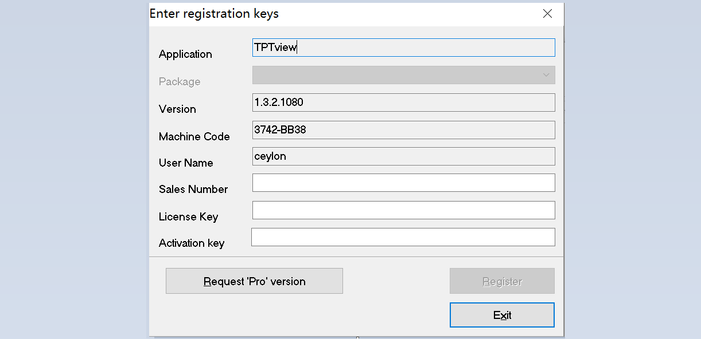
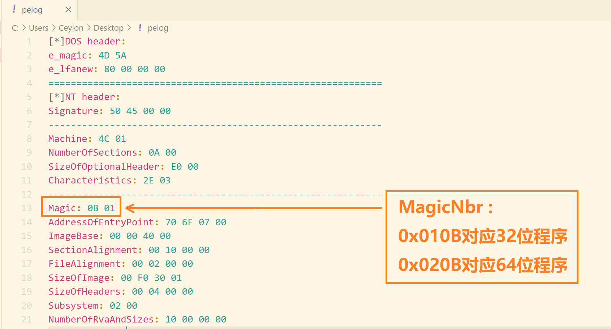
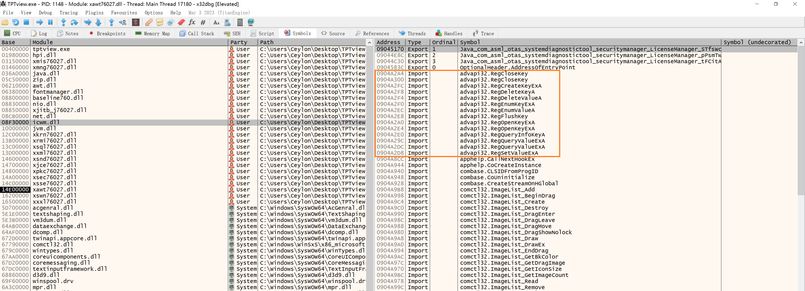
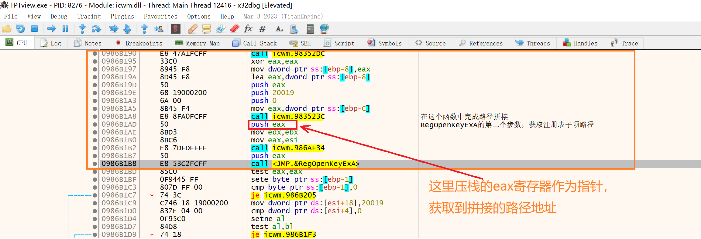
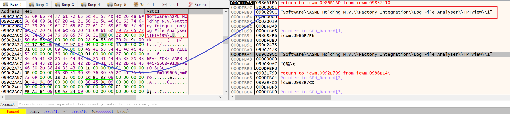
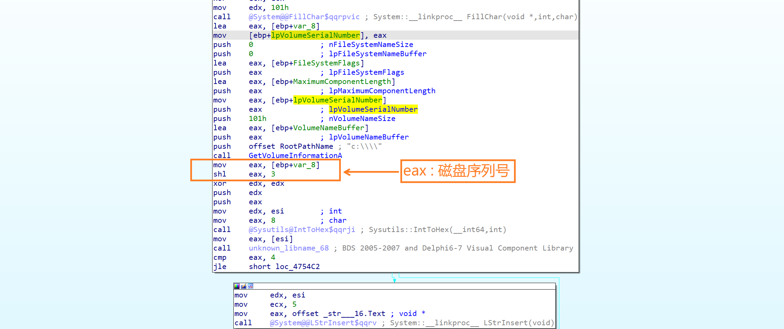
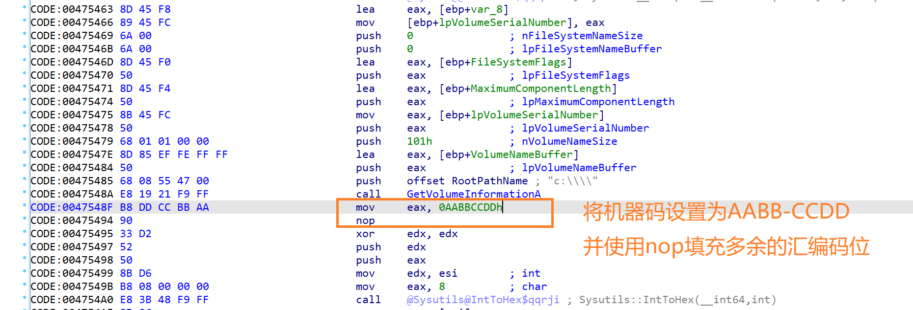
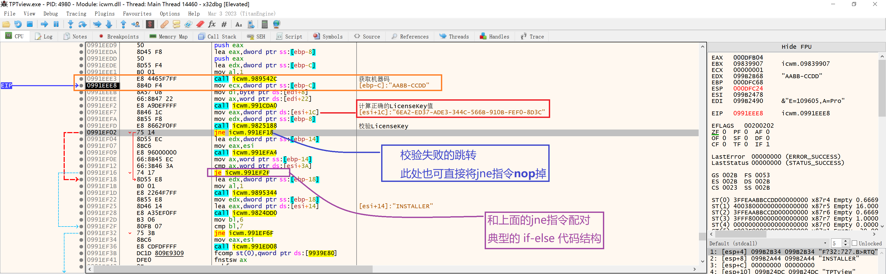
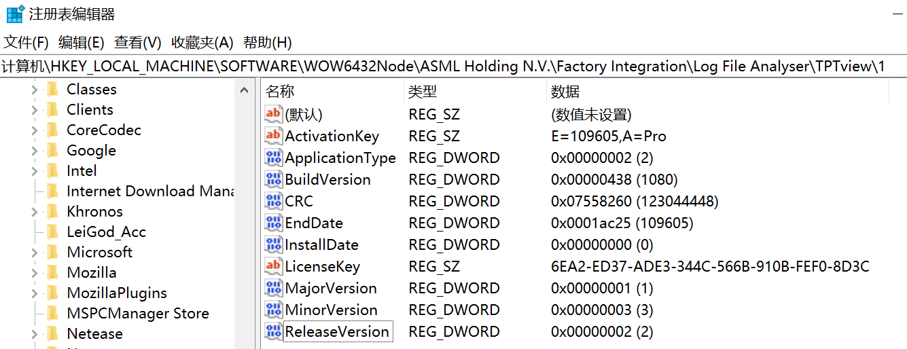
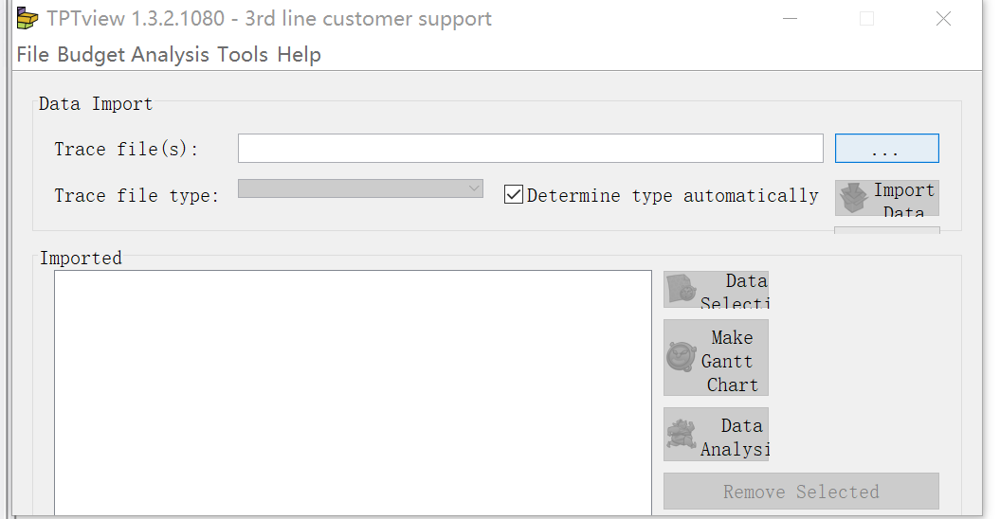

# 逆向工程

## 友商产率工具逆向分析

初次运行该软件时需要License校验。软件界面如下图所示。

从界面上观察，需要通过 **Machine Code** 至少构造出 sales Number、License Key、Activation key 三个值来完成校验。

首先分析 PE 结构。从 PE Header 中的 Magic 字段可以判断出这是一个32位程序，并且其余字段无明显加壳变形的数据特征，都是 PE32 文件很常规普遍的值，省去了脱壳的步骤，不会影响到后续对IAT(导入地址表)的分析。

下面将直接用32位版本的 x64dbg 和 IDA 来完成分析。

> + x64dbg -> 附加程序之后**动态**调试
> + IDA -> **递归下降**反汇编，用于**静态**分析

首先将 x64dbg 附加到运行的程序上，查看各个模块的 IAT。重点观察符号表里是否出现`GetSystemInfo`、`GetVolumeInformation`、`RegOpenKeyEx`，这些 API 是完成 License 校验最常用到的 API，从这些函数打断点步过分析就可以快速切入关键的校验函数。

如下图所示，在 `icwm.dll` 的导入地址表中找到了大量注册表操作 API，推测核心校验逻辑在这个dll中实现。

对 `RegOpenKeyExA` 添加断点并重启程序。在断点处停下后，向上层返回到用户代码部分。分析用户代码部分得知调用 `icwm.983523C` 函数用于拼接路径前缀。

拼接好的路径可以在上图 `eax` 寄存器中储存的指针指向的内存地址找到，记录下这个路径，这个路径就是我们需要新建注册表的存放路径。

再分析生成机器码部分的函数。

使用 IDA 查看调用 `GetVolumeInformationA` 的地方。

为了避免不同磁盘序列号导致生成的 LicenseKey 不同，因此这里修改了汇编代码，将 `eax` 寄存器中储存的磁盘序列号替换为 `AABB-CCDD` 。patch 后的汇编代码如下图所示。

继续从这里向上层代码步过，就可以找到校验 LicenseKey 的地方，并且能直接从 `[esi + 0x1C]` 处内存地址储存的字符串指针获取到 `AABB-CCDD` 这个机器码所对应的正确的 LicenseKey 为 `6EA2-ED37-ADE3-344C-566B-910B-FEF0-8D3C`。

在此层代码继续步过分析，还能得到其他注册表项的正确值。整理如下图：

将这些注册表值填入前面获取到的注册表路径，这样软件在启动的时候就能正确完成校验。

直接运行软件，正常进入：

